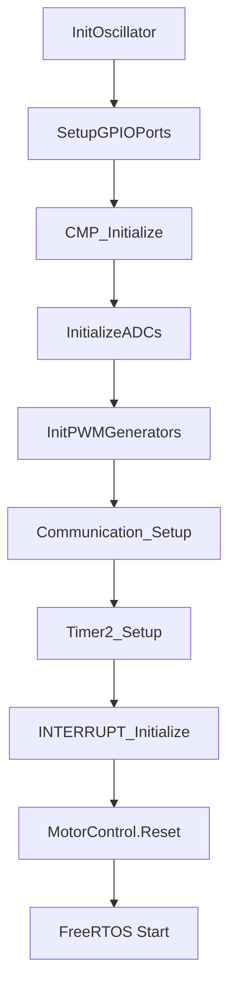

# Chapter 2: HAL 계층 상세

## 목차

1. [HAL 아키텍처 개요](#1-hal-아키텍처-개요)
2. [초기화 순서](#2-초기화-순서)
3. [PWM 드라이버](#3-pwm-드라이버)
4. [ADC 드라이버](#4-adc-드라이버)
5. [UART 드라이버](#5-uart-드라이버)
6. [Timer 드라이버](#6-timer-드라이버)
7. [기타 주변장치](#7-기타-주변장치)
8. [인터럽트 우선순위 관리](#8-인터럽트-우선순위-관리)

---

## 1. HAL 아키텍처 개요

### 1.1 HAL의 역할

**HAL (Hardware Abstraction Layer)**은 하드웨어와 애플리케이션 사이의 추상화 계층으로, 다음과 같은 목적을 가집니다:

✅ **하드웨어 독립성**: 상위 레이어가 HW 세부사항을 몰라도 됨  
✅ **재사용성**: 다른 프로젝트에서 드라이버 재사용 가능  
✅ **유지보수성**: HW 변경 시 HAL만 수정  
✅ **일관된 API**: 표준화된 인터페이스 제공

### 1.2 HAL 파일 구조

```
src/hal/
├── adc.c / adc.h                 # ADC 초기화 및 설정
├── board_service.c / .h          # 보드 서비스 통합
├── clock.c / clock.h             # 클럭/PLL 설정
├── cmp.c / cmp.h                 # 비교기 (과전류 보호)
├── delay.h                       # 지연 함수 매크로
├── device_config.c               # Configuration Bits
├── interrupt.c / .h / _types.h   # 인터럽트 우선순위
├── measure.c / measure.h         # 전류/온도 측정
├── port_config.c / .h            # GPIO 및 PPS
├── pwm.c / pwm.h                 # 3상 PWM 생성
├── timer1.c / timer1.h           # FreeRTOS RTOS Tick
├── timer2.c / timer2.h           # 속도 램프 타이머
├── uart1.c / uart1.h             # UART1 (진단용)
├── uart2.c / uart2.h             # UART2 (메인 통신)
├── uart_interface.h              # UART 인터페이스 구조체
└── uart_types.h                  # UART 에러 타입
```

### 1.3 계층 구조

```
┌──────────────────────────────────────────┐
│     Application Layer                    │
│  (Motor Control, Communication, UI)      │
├──────────────────────────────────────────┤
│     HAL API Layer                        │
│  (InitPeripherals, PWMDutyCycleSet 등)   │
├──────────────────────────────────────────┤
│     HAL Implementation                   │
│  (레지스터 직접 제어)                     │
├──────────────────────────────────────────┤
│     Hardware Registers                   │
│  (PG1CONbits, ADC1CON1 등)               │
└──────────────────────────────────────────┘
```

---

## 2. 초기화 순서

### 2.1 전체 초기화 흐름

`main()` 함수에서 호출되는 초기화 순서:

```c
int main(void)
{
    // 1. 클럭 초기화 (가장 먼저)
    InitOscillator();           // FRC+PLL → 200MHz
    
    // 2. GPIO 초기화
    SetupGPIOPorts();           // GPIO 방향, PPS 핀 매핑
    
    // 3. 주변장치 초기화
    InitPeripherals();          // CMP → ADC → PWM 순서
    
    // 4. 진단 및 보드 서비스
    DiagnosticsInit();
    BoardServiceInit();
    
    // 5. 사용자 모듈 초기화
    Communication_Setup();       // UART2 통신
    LED_Setup();                 // LED 상태 표시
    Timer2_Setup();              // 속도 램프 타이머
    
    // 6. 인터럽트 우선순위 설정
    INTERRUPT_Initialize();
    
    // 7. 모터 제어 초기화
    MotorStateMachine_Init();
    MotorControl.Reset();
    
    // 8. FreeRTOS 시작
    // ... (SW Timer, Task 생성)
    vTaskStartScheduler();       // Timer1 자동 설정됨
    
    while(1);  // 도달 불가
}
```

### 2.2 InitPeripherals() 내부 순서

주변장치 초기화의 상세 순서 (`src/hal/board_service.c`):

```c
void InitPeripherals(void)
{
    // 1. 비교기 초기화 (과전류 보호)
    CMP_Initialize();
    CMP1_ModuleEnable(true);
    CMP1_ReferenceSet(/* 임계값 */);
    
    // 2. ADC 초기화
    InitializeADCs();
    // 주의: ADC 인터럽트는 아직 비활성화 상태
    
    // 3. PWM 초기화
    InitPWMGenerators();
    // PWM 출력도 아직 비활성화 상태
    
    // 4. ADC 인터럽트 명시적 비활성화
    DisableADCInterrupt();
}
```

**중요**: ADC 인터럽트는 `MotorControl.Reset()` 호출 시 활성화됩니다.

### 2.3 초기화 순서 의존성



**의존성 이유**:
- Clock → GPIO: GPIO는 클럭이 안정화된 후 설정
- CMP → ADC: ADC 트리거가 CMP에 연결될 수 있음
- ADC → PWM: PWM이 ADC 트리거를 생성
- PWM → Motor: 모터 제어가 PWM 사용

---

## 3. PWM 드라이버

### 3.1 PWM 개요

**파일**: `src/hal/pwm.c`, `src/hal/pwm.h`

**역할**: 3상 인버터를 위한 고해상도 Center-Aligned PWM 생성

**하드웨어**: PG1, PG2, PG4 (PWM Generator 1, 2, 4)

### 3.2 PWM 사양

| 항목 | 값 |
|------|-----|
| **주파수** | 20kHz |
| **주기 (TCY)** | 50µs (5000 TCY @ 100MHz) |
| **정렬 모드** | Center-Aligned |
| **출력 모드** | Complementary (H-브릿지) |
| **데드타임** | 1µs (100 TCY) |
| **해상도** | 10ns (FCY=100MHz 기준) |

### 3.3 PWM 설정 코드

`src/hal/pwm.c`의 핵심 초기화 코드:

```c
void InitPWMGenerators(void)
{
    // PG1, PG2, PG4 공통 설정
    
    // 1. 주파수 설정
    // PTPER = (FCY / PWM_FREQ / 2) - 1
    // = (100MHz / 20kHz / 2) - 1 = 2499
    PG1PER = LOOPTIME_TCY;  // LOOPTIME_TCY = 2500
    
    // 2. 데드타임 설정
    // DTR = 1µs * FCY = 100 TCY
    PG1DTL = DEADTIME_TCY;  // 100
    PG1DTH = DEADTIME_TCY;
    
    // 3. 동작 모드
    PG1CONbits.ON = 1;               // PWM 활성화
    PG1CONbits.CLKSEL = 0b01;        // FCY 클럭 소스
    PG1CONbits.MODSEL = 0b000;       // Independent Edge
    
    // 4. Center-Aligned 설정
    PG1IOCONbits.PMOD = 0b00;        // Complementary
    PG1IOCONbits.PENH = 1;           // PWMxH 활성화
    PG1IOCONbits.PENL = 1;           // PWMxL 활성화
    
    // 5. ADC 트리거 설정
    PG1TRIGA = ADC_SAMPLING_POINT;   // PWM 중앙에서 ADC 트리거
    
    // 6. 폴트 입력 설정
    PG1IOCONbits.FLTMOD = 0b11;      // Fault 시 High-Z
    
    // 초기 듀티: 0 (안전)
    PG1DC = MIN_DUTY;
    
    // PG2, PG4도 동일하게 설정
    // ...
}
```

### 3.4 PWM 듀티 설정 API

**단일 엣지 모드 (Dual Shunt)**:

```c
void PWMDutyCycleSet(MC_DUTYCYCLEOUT_T *pPwmDutycycle)
{
    // Center-Aligned이므로 듀티를 2로 나눔
    PG1DC = pPwmDutycycle->dutycycle1 >> 1;
    PG2DC = pPwmDutycycle->dutycycle2 >> 1;
    PG4DC = pPwmDutycycle->dutycycle3 >> 1;
}
```

**듀얼 엣지 모드 (Single Shunt)**:

```c
void PWMDutyCycleSetDualEdge(MC_DUTYCYCLEOUT_T *pPwmDutycycle1,
                              MC_DUTYCYCLEOUT_T *pPwmDutycycle2)
{
    // 첫 번째 엣지
    PG1DC = pPwmDutycycle1->dutycycle1 >> 1;
    PG2DC = pPwmDutycycle1->dutycycle2 >> 1;
    PG4DC = pPwmDutycycle1->dutycycle3 >> 1;
    
    // 두 번째 엣지 (Single Shunt 전류 샘플링)
    PG1PHASE = pPwmDutycycle2->dutycycle1 >> 1;
    PG2PHASE = pPwmDutycycle2->dutycycle2 >> 1;
    PG4PHASE = pPwmDutycycle2->dutycycle3 >> 1;
}
```

### 3.5 PWM 활성화/비활성화

```c
// PWM 출력 활성화
void EnablePWMOutputsInverterA(void)
{
    PG1IOCONbits.OVRENH = 0;  // Override 해제
    PG1IOCONbits.OVRENL = 0;
    PG2IOCONbits.OVRENH = 0;
    PG2IOCONbits.OVRENL = 0;
    PG4IOCONbits.OVRENH = 0;
    PG4IOCONbits.OVRENL = 0;
}

// PWM 출력 비활성화 (모터 정지)
void DisablePWMOutputsInverterA(void)
{
    PG1IOCONbits.OVRENH = 1;  // Override 설정
    PG1IOCONbits.OVRENL = 1;
    PG1IOCONbits.OVRDAT = 0;  // Low로 출력
    // PG2, PG4도 동일
}
```

### 3.6 PWM 타이밍 다이어그램

```
Center-Aligned PWM (20kHz):

       ┌─────────────┐
PWMxH  │             │          듀티 50%
     ──┘             └──────
       │<-Dead Time->│
       │   ┌─────┐   │
PWMxL  │   │     │   │          Complementary
     ──────┘     └──────────
       
       ^           ^
       │           │
    상승 엣지    하강 엣지
       
       ^
       │
    ADC 트리거 (중앙)
    
타임라인:
0µs          25µs         50µs
├─────────────┼─────────────┤
     상승          하강
```

---

## 4. ADC 드라이버

### 4.1 ADC 개요

**파일**: `src/hal/adc.c`, `src/hal/adc.h`

**역할**: 모터 전류, DC 버스 전압, 온도 등 아날로그 신호 디지털 변환

**하드웨어**: 12비트 SAR ADC

### 4.2 ADC 채널 할당

| 채널 | 신호 | 용도 |
|------|------|------|
| AN0 | IPHASE1 | 위상 전류 Ia (또는 Ib) |
| AN1 | IPHASE2 | 위상 전류 Ib (또는 Ia) |
| AN4 | IBUS | DC 버스 전류 (Single Shunt) |
| AN11 | POT | 속도 기준 (가변저항) |
| AN12 | TEMP | MOSFET 온도 |
| AN15 | VBUS | DC 버스 전압 |

### 4.3 ADC 설정 코드

```c
void InitializeADCs(void)
{
    // 1. ADC 모듈 비활성화 (설정 중)
    ADCON1Lbits.ADON = 0;
    
    // 2. 클럭 설정
    ADCON3Hbits.CLKSEL = 0b01;  // FCY
    ADCON3Hbits.CLKDIV = 0;     // 분주 없음
    
    // 3. 해상도 및 형식
    ADCORE0Hbits.RES = 0b11;    // 12비트
    ADCORE1Hbits.RES = 0b11;
    
    // 4. 샘플링 시간
    ADCORE0Hbits.SAMC = 2;      // 2 TAD
    
    // 5. 트리거 소스
    // AN0, AN1: PWM1 Trigger A (PG1TRIGA)
    ADTRIGxL/H 레지스터 설정
    
    // 6. 인터럽트 설정
    ADIELbits.IE0 = 1;          // AN0 인터럽트 활성화
    _ADCAN0IF = 0;
    _ADCAN0IE = 1;
    
    // 7. ADC 활성화
    ADCON1Lbits.ADON = 1;
    
    // 8. ADC 코어 준비 대기
    while(ADCON5Lbits.C0RDY == 0);
    while(ADCON5Lbits.C1RDY == 0);
}
```

### 4.4 ADC 읽기

ADC 값은 매크로로 읽습니다 (`src/hal/adc.h`):

```c
#define ADCBUF_INV_A_IPHASE1    ADCBUF0   // AN0
#define ADCBUF_INV_A_IPHASE2    ADCBUF1   // AN1
#define ADCBUF_INV_A_IBUS       ADCBUF4   // AN4
#define ADCBUF_VBUS_A           ADCBUF15  // AN15
#define ADCBUF_MOSFET_TEMP_A    ADCBUF12  // AN12
#define ADCBUF_SPEED_REF_A      ADCBUF11  // AN11
```

**사용 예** (ADC ISR 내):

```c
void __attribute__((__interrupt__)) _ADCInterrupt()
{
    // 전류 읽기
    measureInputs.current.Ia = ADCBUF_INV_A_IPHASE1;
    measureInputs.current.Ib = ADCBUF_INV_A_IPHASE2;
    
    // 전압 읽기
    measureInputs.dcBusVoltage = (int16_t)(ADCBUF_VBUS_A >> 1);
    
    // 온도 읽기
    MCAPP_MeasureTemperature(&measureInputs, 
                             (int16_t)(ADCBUF_MOSFET_TEMP_A >> 1));
    
    // ...
}
```

### 4.5 ADC 인터럽트 제어

```c
// ADC 인터럽트 활성화
void EnableADCInterrupt(void)
{
    _ADCAN0IF = 0;
    _ADCAN0IE = 1;
}

// ADC 인터럽트 비활성화
void DisableADCInterrupt(void)
{
    _ADCAN0IE = 0;
}

// 플래그 클리어
void ClearADCIF(void)
{
    _ADCAN0IF = 0;
}
```

### 4.6 전류 오프셋 보정

ADC는 바이폴라 신호를 측정하기 위해 오프셋을 사용합니다 (`src/hal/measure.c`):

```c
// 오프셋 측정 (모터 정지 시)
void MCAPP_MeasureCurrentOffset(MCAPP_MEASURE_T *pMotorInputs)
{
    pMotorInputs->current.offsetIa += pMotorInputs->current.Ia;
    pMotorInputs->current.offsetIb += pMotorInputs->current.Ib;
    pMotorInputs->current.offsetIbus += pMotorInputs->current.Ibus;
    pMotorInputs->current.counter++;
    
    if (pMotorInputs->current.counter >= OFFSET_COUNT_MAX)
    {
        // 평균 계산
        pMotorInputs->current.offsetIa /= OFFSET_COUNT_MAX;
        pMotorInputs->current.offsetIb /= OFFSET_COUNT_MAX;
        pMotorInputs->current.offsetIbus /= OFFSET_COUNT_MAX;
        pMotorInputs->current.offsetStatus = 1;  // 완료
    }
}

// 오프셋 보정 (FOC 제어 시)
void MCAPP_MeasureCurrentCalibrate(MCAPP_MEASURE_T *pMotorInputs)
{
    pMotorInputs->current.Ia -= pMotorInputs->current.offsetIa;
    pMotorInputs->current.Ib -= pMotorInputs->current.offsetIb;
    pMotorInputs->current.Ibus -= pMotorInputs->current.offsetIbus;
}
```

---

## 5. UART 드라이버

### 5.1 UART 개요

본 프로젝트는 2개의 UART를 사용합니다:

| UART | 용도 | 보레이트 | 구현 방식 |
|------|------|----------|-----------|
| **UART1** | 진단/디버그 | 가변 | 직접 레지스터 접근 (inline) |
| **UART2** | 메인 통신 | 19200 | 인터페이스 패턴 (DI) |

### 5.2 UART2 인터페이스 패턴

UART2는 **의존성 주입(DI)** 패턴을 사용합니다.

**파일**: `src/hal/uart2.c`, `src/hal/uart_interface.h`

#### 5.2.1 UART_INTERFACE 구조체

```c
// src/hal/uart_interface.h
typedef struct
{
    void (*Initialize)(void);
    void (*Deinitialize)(void);
    uint8_t (*Read)(void);
    void (*Write)(uint8_t);
    bool (*IsRxReady)(void);
    bool (*IsTxReady)(void);
    bool (*IsTxDone)(void);
    void (*TransmitEnable)(void);
    void (*TransmitDisable)(void);
    uint16_t (*BaudRateSet)(uint32_t);
    uint32_t (*BaudRateGet)(void);
    // ... (기타 함수 포인터)
} UART_INTERFACE;
```

#### 5.2.2 UART2_Drv 전역 인스턴스

```c
// src/hal/uart2.c
const UART_INTERFACE UART2_Drv = {
    .Initialize = UART2_Initialize,
    .Deinitialize = UART2_Deinitialize,
    .Read = UART2_Read,
    .Write = UART2_Write,
    .IsRxReady = UART2_IsRxReady,
    .IsTxReady = UART2_IsTxReady,
    .IsTxDone = UART2_IsTxDone,
    .TransmitEnable = UART2_TransmitEnable,
    .TransmitDisable = UART2_TransmitDisable,
    .BaudRateSet = UART2_BaudRateSet,
    .BaudRateGet = UART2_BaudRateGet,
    // ...
};
```

#### 5.2.3 사용 예

```c
// 통신 모듈에서 사용
UART2_Drv.Initialize();
UART2_Drv.BaudRateSet(19200);
UART2_Drv.TransmitEnable();

if (UART2_Drv.IsRxReady()) {
    uint8_t data = UART2_Drv.Read();
    // 처리
}

UART2_Drv.Write(0x40);  // STX 전송
```

### 5.3 UART2 초기화 코드

```c
void UART2_Initialize(void)
{
    // 1. UART 비활성화
    U2MODEbits.UARTEN = 0;
    U2STAbits.UTXEN = 0;
    
    // 2. 모드 설정
    U2MODEbits.STSEL = 0;   // 1 Stop bit
    U2MODEbits.PDSEL = 0;   // 8-bit, No Parity
    U2MODEbits.BRGH = 1;    // High-Speed
    
    // 3. 보레이트 설정
    UART2_BaudRateSet(19200);
    
    // 4. 인터럽트 설정
    IPC7bits.U2RXIP = 3;    // IPL 3
    IPC7bits.U2TXIP = 3;
    
    _U2RXIF = 0;
    _U2RXIE = 1;            // RX 인터럽트 활성화
    
    // 5. UART 활성화
    U2MODEbits.UARTEN = 1;
    U2STAbits.UTXEN = 1;
}
```

### 5.4 UART2 인터럽트 핸들러

```c
void __attribute__((__interrupt__, no_auto_psv)) _U2RXInterrupt(void)
{
    _U2RXIF = 0;
    
    while (U2STAbits.URXDA)  // 수신 버퍼에 데이터 있음
    {
        uint8_t data = U2RXREG;
        
        // 콜백 호출
        if (uart2RxCompleteCallback != NULL)
        {
            uart2RxCompleteCallback(data);
        }
    }
}
```

콜백 등록:

```c
void UART2_RxCompleteCallbackRegister(void (*callback)(uint8_t))
{
    uart2RxCompleteCallback = callback;
}
```

### 5.5 printf 리다이렉션

`src/hal/uart2.c`에 `write()` 함수를 재정의하여 `printf`가 UART2로 출력되도록 합니다:

```c
int write(int handle, void *buffer, unsigned int len)
{
    unsigned int i;
    
    if (handle == 1)  // stdout
    {
        for (i = 0; i < len; i++)
        {
            while (!UART2_IsTxReady());
            UART2_Write(((uint8_t*)buffer)[i]);
        }
    }
    return len;
}
```

**사용**:

```c
printf("Motor Speed: %d RPM\n", speed);  // UART2로 출력
```

---

## 6. Timer 드라이버

### 6.1 Timer 개요

본 프로젝트는 2개의 타이머를 사용합니다:

| Timer | 역할 | 주기 | 우선순위 |
|-------|------|------|----------|
| **Timer1** | FreeRTOS RTOS Tick | 1ms | IPL 1 |
| **Timer2** (SCCP1) | 속도 램프 제어 | 50µs | IPL 5 |

### 6.2 Timer1: FreeRTOS RTOS Tick

**파일**: `src/hal/timer1.c`

Timer1은 FreeRTOS의 RTOS Tick으로만 사용됩니다. FreeRTOS `port.c`의 `weak` 함수를 오버라이드합니다:

```c
// src/hal/timer1.c
void vApplicationSetupTickTimerInterrupt(void)
{
    // 1ms @ FCY=100MHz, TCKPS=1:8
    // PR1 = (1ms * 100MHz / 8) - 1 = 12499
    PR1 = 12499;
    
    // 프리스케일러: 1:8
    T1CONbits.TCKPS = 0b01;  // dsPIC33CK: 2비트 필드
    
    // 타이머 시작
    T1CONbits.TON = 1;
    
    // 인터럽트 설정
    IPC0bits.T1IP = 1;  // IPL 1 (가장 낮음)
    _T1IF = 0;
    _T1IE = 1;
}
```

**Timer1 ISR**:

```c
void __attribute__((__interrupt__, no_auto_psv)) _T1Interrupt(void)
{
    _T1IF = 0;
    
    // FreeRTOS Tick 카운터 증가
    if (xTaskIncrementTick() != pdFALSE)
    {
        // 컨텍스트 스위칭 필요
        portYIELD();
    }
}
```

### 6.3 Timer2: 속도 램프 제어

**파일**: `src/hal/timer2.c`

Timer2는 SCCP1 모듈을 16비트 타이머 모드로 사용합니다.

#### 6.3.1 Timer2 초기화

```c
void Timer2_Init(void)
{
    // SCCP1을 16비트 타이머 모드로 설정
    CCP1CON1Lbits.CCSEL = 0;     // 타이머 모드
    CCP1CON1Lbits.MOD = 0b0000;  // 16비트 타이머
    
    // 클럭 소스: FCY
    CCP1CON1Lbits.CLKSEL = 0b000;
    
    // 프리스케일러: 1:4
    CCP1CON1Lbits.TMRPS = 0b01;
    
    // 주기: 50µs
    // CCP1PRL = (50µs * 100MHz / 4) - 1 = 1249
    CCP1PRL = 1249;
    
    // 인터럽트 설정
    IPC1bits.CCP1IP = 5;  // IPL 5 (RTOS 외부)
    _CCP1IF = 0;
    _CCP1IE = 1;
    
    // 타이머 시작
    CCP1CON1Lbits.CCPON = 1;
}
```

#### 6.3.2 콜백 등록

```c
static Timer2_cb callbackFunc = NULL;

void Timer2_RegisterCallback(Timer2_cb cb)
{
    callbackFunc = cb;
}
```

#### 6.3.3 Timer2 ISR

```c
void __attribute__((__interrupt__, no_auto_psv)) _CCP1Interrupt(void)
{
    _CCP1IF = 0;
    
    if (callbackFunc != NULL)
    {
        callbackFunc();
    }
}
```

#### 6.3.4 사용 예

```c
// main()에서
Timer2_Init();
Timer2_RegisterCallback(SpeedRamp_50us_Callback);

// 콜백 함수
void SpeedRamp_50us_Callback(void)
{
    update_speed_target();      // 속도 램프 업데이트
    X2C_VelRef = MotorData_cmd.speed_target;
}
```

---

## 7. 기타 주변장치

### 7.1 CMP (비교기)

**파일**: `src/hal/cmp.c`, `src/hal/cmp.h`

**역할**: 과전류 보호용 하드웨어 비교기

```c
void CMP_Initialize(void)
{
    // DAC1 기준 전압 설정
    CMP1_ReferenceSet(/* 임계값 */);
    
    // 비교기 활성화
    CMP1_ModuleEnable(true);
    
    // PWM 폴트 입력에 연결
    // (PWM 설정에서 처리)
}

void CMP1_ReferenceSet(uint16_t value)
{
    DAC1CONLbits.DACDAT = value;
}
```

### 7.2 Clock (클럭)

**파일**: `src/hal/clock.c`, `src/hal/clock.h`

**역할**: PLL 기반 클럭 설정

```c
void InitOscillator(void)
{
    // FRC (8MHz) + PLL → 200MHz
    PLLFBD = 50 - 2;        // M = 50
    CLKDIVbits.PLLPRE = 0;  // N1 = 1
    CLKDIVbits.PLLPOST = 0; // N2 = 2
    
    // 클럭 소스 전환
    __builtin_write_OSCCONH(0x01);  // FRC+PLL
    __builtin_write_OSCCONL(OSCCON | 0x01);
    
    // 전환 대기
    while (OSCCONbits.OSWEN);
    while (!OSCCONbits.LOCK);  // PLL Lock
}
```

**상수** (`src/hal/clock.h`):

```c
#define FOSC        200000000UL  // 200MHz
#define FCY         (FOSC/2)     // 100MHz
#define FOSC_MHZ    200
```

### 7.3 GPIO 및 PPS

**파일**: `src/hal/port_config.c`, `src/hal/port_config.h`

**역할**: GPIO 방향 설정 및 PPS (Peripheral Pin Select) 매핑

```c
void SetupGPIOPorts(void)
{
    // 아날로그 입력
    ANSELAbits.ANSELA0 = 1;  // AN0 (Ia)
    ANSELAbits.ANSELA1 = 1;  // AN1 (Ib)
    
    // 디지털 출력
    TRISAbits.TRISA7 = 0;    // LED1
    
    // 디지털 입력
    TRISEbits.TRISE7 = 1;    // SW1
    
    // PPS 매핑
    MapGPIOHWFunction();
}

void MapGPIOHWFunction(void)
{
    // UART2 RX/TX 매핑
    _U2RXR = 43;   // RPI43 (RB11) → U2RX
    _RP42R = 0x03; // RP42 (RB10) → U2TX
    
    // 레지스터 잠금
    __builtin_write_OSCCONL(OSCCON | 0x40);
}
```

---

## 8. 인터럽트 우선순위 관리

### 8.1 인터럽트 우선순위 체계

**파일**: `src/hal/interrupt.c`, `src/hal/interrupt_types.h`

dsPIC33CK는 **IPL (Interrupt Priority Level) 0~7**을 지원합니다.

| IPL | 소스 | FreeRTOS API | 역할 |
|-----|------|--------------|------|
| **7** | ADC | 불가 | FOC 제어 (20kHz) |
| **6** | PWM Fault | 불가 | 폴트 처리 |
| **5** | Timer2 (SCCP1) | 불가 | 속도 램프 (50µs) |
| **4** | - | **경계** | `configMAX_SYSCALL_INTERRUPT_PRIORITY` |
| **3** | UART1/UART2 | 가능 | 통신 (FromISR API) |
| **2** | - | 가능 | (예약) |
| **1** | Timer1 | - | FreeRTOS Tick |
| **0** | - | - | 인터럽트 비활성화 |

### 8.2 INTERRUPT_Initialize()

```c
// src/hal/interrupt.c
void INTERRUPT_Initialize(void)
{
    // IPL 7: ADC
    _ADCAN0IP = 7;
    
    // IPL 6: PWM Fault
    _PWM1IP = 6;
    
    // IPL 5: Timer2 (SCCP1)
    _CCP1IP = 5;
    
    // IPL 3: UART
    _U1RXIP = 3;
    _U1TXIP = 3;
    _U2RXIP = 3;
    _U2TXIP = 3;
    
    // IPL 1: Timer1 (RTOS Tick)
    _T1IP = 1;
    
    // 전역 인터럽트 활성화
    INTERRUPT_GlobalEnable();
}

void INTERRUPT_GlobalEnable(void)
{
    INTCON2bits.GIE = 1;
}
```

### 8.3 FreeRTOS 경계

`src/config/FreeRTOSConfig.h`:

```c
// IPL 4 이상: RTOS API 호출 불가
#define configMAX_SYSCALL_INTERRUPT_PRIORITY  4

// RTOS 커널 우선순위
#define configKERNEL_INTERRUPT_PRIORITY       1
```

**중요**: IPL 4 이상에서는 `xQueueSendFromISR`, `xSemaphoreGiveFromISR` 등 FromISR API도 사용할 수 없습니다.

### 8.4 Critical Section

FreeRTOS의 Critical Section은 **IPL 1~4만 비활성화**합니다:

```c
void vPortEnterCritical(void)
{
    portDISABLE_INTERRUPTS();  // SET_CPU_IPL(1)
    uxCriticalNesting++;
}
```

**영향**:
- ADC ISR (IPL 7), Timer2 ISR (IPL 5)는 Critical Section 중에도 실행됨
- 따라서 Critical Section 내에서도 ISR-Task 간 공유 변수에 주의 필요

---

## 다음 단계

HAL 계층의 상세 구현을 확인하셨다면, 다음 챕터에서 FOC 알고리즘의 구현을 확인하세요:

- **[Chapter 3: FOC 제어 알고리즘 →](03_FOC_algorithm.md)**

---

**이전**: [← Chapter 1: AN1292 기반 시스템](01_AN1292_base_system.md)  
**다음**: [Chapter 3: FOC 제어 알고리즘 →](03_FOC_algorithm.md)
