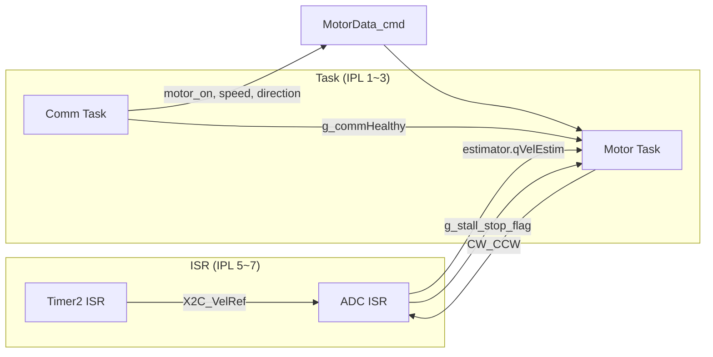

# Chapter 4: FreeRTOS 실시간 시스템

## 목차

1. [3개 태스크 구조 (Motor/Comm/UI) 상세](#1-3개-태스크-구조-motorcommui-상세)
2. [태스크 우선순위와 스케줄링 전략](#2-태스크-우선순위와-스케줄링-전략)
3. [Software Timer 활용 (LED 1ms, Comm 1ms)](#3-software-timer-활용-led-1ms-comm-1ms)
4. [ISR과 태스크 간 데이터 공유 및 동기화](#4-isr과-태스크-간-데이터-공유-및-동기화)
5. [Critical Section 처리 방법](#5-critical-section-처리-방법)
6. [실시간 시스템 설계 고려사항](#6-실시간-시스템-설계-고려사항)

---

## 1. 3개 태스크 구조 (Motor/Comm/UI) 상세

### 1.1 태스크 개요

```
┌─────────────────────────────────────────────────────────────────────────┐
│                     FreeRTOS 태스크 구조                                   │
├─────────────────────────────────────────────────────────────────────────┤
│                                                                         │
│  vMotorTask (P3, 1ms)     vCommTask (P2, 10ms)     vUITask (P1, 10ms)   │
│  ┌─────────────────┐     ┌─────────────────┐     ┌─────────────────┐   │
│  │ BoardService()   │     │ communication() │     │ DiagnosticsStep │   │
│  │ StateMachine    │     │ (RX→Parse→TX)    │     │ LedMorse.Update │   │
│  │ MotorData_now   │     │                 │     │ LedBlinker.Update│   │
│  │ Protocol_SetRpm │     │                 │     │                 │   │
│  └─────────────────┘     └─────────────────┘     └─────────────────┘   │
│           │                        │                       │           │
│           └────────────────────────┴───────────────────────┘           │
│                                    │                                   │
│                            vTaskDelay / vTaskDelayUntil                 │
└─────────────────────────────────────────────────────────────────────────┘
```

### 1.2 vMotorTask (우선순위 3, 1ms 주기)

**파일**: `src/pmsm.c` 184~203행

```c
static void vMotorTask(void *pvParameters)
{
    TickType_t xLastWakeTime = xTaskGetTickCount();

    for (;;)
    {
        BoardService();                    // 버튼 스캔
        MotorStateMachine_Execute();       // 5-State Machine
        MotorData_now.speed = (int32_t)estimator.qVelEstim * 2;  // 현재 속도
        Protocol_SetPresentRpm((uint16_t)abs(MotorData_now.speed));  // TX 데이터

        vTaskDelayUntil(&xLastWakeTime, pdMS_TO_TICKS(1));  // 정확한 1ms 주기
    }
}
```

**역할**:
- 모터 상태머신 실행 (STOPPED → STARTING → RUNNING → STOPPING → FAULT)
- 현재 속도 업데이트 (estimator → MotorData_now)
- TX 응답용 RPM 설정
- `vTaskDelayUntil`으로 **정확한 1ms 주기** 보장

### 1.3 vCommTask (우선순위 2, 10ms 주기)

**파일**: `src/pmsm.c` 206~215행

```c
static void vCommTask(void *pvParameters)
{
    for (;;)
    {
        communication();   // RX 파싱, TX 전송, 건강 상태 판단

        vTaskDelay(pdMS_TO_TICKS(10));  // 약 10ms 주기
    }
}
```

**역할**:
- UART2 수신 패킷 처리 (검증, 파싱, 디스패치)
- 100ms 주기 TX 응답 전송
- 1초 주기 통신 건강 상태 판단

### 1.4 vUITask (우선순위 1, 10ms 주기)

**파일**: `src/pmsm.c` 218~234행

```c
static void vUITask(void *pvParameters)
{
    for (;;)
    {
        DiagnosticsStepMain();

        if (!LedMorse.Update())   // Morse 우선 (모터 구동 시 RPM 표시)
        {
            LedBlinker.Update();  // idle이면 Blinker (통신 상태)
        }

        vTaskDelay(pdMS_TO_TICKS(10));
    }
}
```

**역할**:
- 진단 모듈 실행
- LED 업데이트: Morse(구동 시) > Blinker(정지 시)

---

## 2. 태스크 우선순위와 스케줄링 전략

### 2.1 우선순위 배치

| 태스크 | 우선순위 | 주기 | 스택 | 용도 |
|--------|----------|------|------|------|
| **Motor** | 3 (최고) | 1ms | 512 words | 상태머신, 속도 |
| **Comm** | 2 | 10ms | 512 words | UART 통신 |
| **UI** | 1 | 10ms | 256 words | LED, 진단 |

**설정**: `src/pmsm.c` 292~294행

```c
xTaskCreate(vMotorTask, "Motor", 512, NULL, 3, NULL);
xTaskCreate(vCommTask,  "Comm",  512, NULL, 2, NULL);
xTaskCreate(vUITask,    "UI",    256, NULL, 1, NULL);
```

### 2.2 스케줄링 다이어그램

```mermaid
gantt
    title FreeRTOS 태스크 스케줄 (선점형)
    dateFormat X
    axisFormat %L

    section Motor (P3)
    Motor 1ms    :a1, 0, 1
    Motor 1ms    :a2, 10, 1
    Motor 1ms    :a3, 20, 1

    section Comm (P2)
    Comm 10ms    :b1, 2, 2
    Comm 10ms    :b2, 12, 2

    section UI (P1)
    UI 10ms      :c1, 4, 1
    UI 10ms      :c2, 14, 1
```



### 2.3 FreeRTOSConfig.h 설정

**파일**: `src/config/FreeRTOSConfig.h`

```c
#define configUSE_PREEMPTION            1   // 선점형
#define configTICK_RATE_HZ              1000 // 1ms tick
#define configMAX_PRIORITIES            4
#define configTOTAL_HEAP_SIZE            8192
#define configUSE_TIMERS                1   // SW Timer
#define configTIMER_TASK_PRIORITY       3   // Timer 태스크 = Motor와 동급
```

---

## 3. Software Timer 활용 (LED 1ms, Comm 1ms)

### 3.1 기존 Timer1 1ms 콜백의 분리

원래 Timer1에서 1ms마다 LED/통신 카운터를 증가시키던 로직을 **FreeRTOS Software Timer**로 이전했습니다.

```
[기존]
Timer1 ISR (1ms) → LED 카운터++, 통신 카운터++

[변경]
Timer1 → FreeRTOS RTOS Tick 전용
SW Timer (1ms) → vLedTimerCallback, vCommTimerCallback
```

### 3.2 Software Timer 생성 및 시작

**파일**: `src/pmsm.c` 282~289행

```c
TimerHandle_t xLedTimer  = xTimerCreate("LED",  pdMS_TO_TICKS(1), pdTRUE, NULL, vLedTimerCallback);
TimerHandle_t xCommTimer = xTimerCreate("Comm", pdMS_TO_TICKS(1), pdTRUE, NULL, vCommTimerCallback);

if (xLedTimer != NULL)  { xTimerStart(xLedTimer,  0); }
if (xCommTimer != NULL) { xTimerStart(xCommTimer, 0); }
```

- `pdTRUE`: Auto-reload (반복)
- 주기: 1ms

### 3.3 LED Timer 콜백

**파일**: `src/pmsm.c` 163~168행

```c
static void vLedTimerCallback(TimerHandle_t xTimer)
{
    (void)xTimer;
    LedBlinker.TimerISR();   // ledTimer1ms++
    LedMorse.TimerISR();     // morseTimer1ms++
}
```

### 3.4 Comm Timer 콜백

**파일**: `src/pmsm.c` 171~175행

```c
static void vCommTimerCallback(TimerHandle_t xTimer)
{
    (void)xTimer;
    timer1ms_communication();  // g_timer1ms_comm++, g_healthCheckTimer++
}
```

### 3.5 타이머 구조 ASCII

```
┌─────────────────────────────────────────────────────────────────┐
│                    타이머 구조                                     │
├─────────────────────────────────────────────────────────────────┤
│                                                                 │
│  Timer1 (HW, IPL 1)          Software Timer (FreeRTOS)          │
│  ┌─────────────────┐         ┌─────────────────┐                │
│  │ RTOS Tick       │         │ LED (1ms)        │                │
│  │ xTaskIncrement  │         │ LedBlinker      │                │
│  │ Tick()         │         │ LedMorse         │                │
│  └─────────────────┘         └─────────────────┘                │
│                              ┌─────────────────┐                │
│  Timer2 (SCCP1, IPL 5)       │ Comm (1ms)      │                │
│  ┌─────────────────┐         │ timer1ms_comm   │                │
│  │ 50us 속도 램프   │         └─────────────────┘                │
│  │ SpeedRamp_CB    │                                               │
│  └─────────────────┘                                               │
│                                                                 │
└─────────────────────────────────────────────────────────────────┘
```

---

## 4. ISR과 태스크 간 데이터 공유 및 동기화

### 4.1 공유 변수 목록

| 변수 | 쓰기 | 읽기 | volatile | 용도 |
|------|------|------|----------|------|
| `MotorData_cmd` | Comm Task | Motor Task, ADC ISR | - | 통신→모터 명령 |
| `MotorData_now.speed` | Motor Task (estimator) | Comm, UI | - | 현재 속도 |
| `X2C_VelRef` | Timer2 ISR | ADC ISR (DoControl) | ✓ | 속도 기준 |
| `CW_CCW` | Motor Task | ADC ISR | ✓ | 회전 방향 |
| `g_stall_stop_flag` | ADC ISR | Motor Task | ✓ | 스톨 감지 |
| `estimator.qVelEstim` | ADC ISR (Estim) | Motor Task | - | 추정 속도 |
| `g_commHealthy` | Comm Task | Motor Task, UI | - | 통신 건강 |

### 4.2 데이터 흐름 다이어그램



### 4.3 volatile 사용

**Timer2 → ADC** (`src/motor/motor_speed.c`):

```c
volatile int X2C_VelRef;  // Timer2 ISR 쓰기, ADC ISR 읽기
```

**Task → ADC** (`src/pmsm.c`):

```c
volatile unsigned int CW_CCW, CW_CCW_OLD;  // Task 쓰기, ADC ISR 읽기
volatile uint8_t g_stall_stop_flag;        // ADC ISR 쓰기, Task 읽기
```

### 4.4 동기화 전략

- **Lock-free**: 대부분 단일 쓰기/다중 읽기 패턴
- **Critical Section**: `ResetParmeters()` 호출 시에만 사용 (아래 참조)
- **RTOS API 미사용**: ADC/Timer2 ISR은 IPL 5~7이므로 `xSemaphoreGiveFromISR` 등 호출 불가

---

## 5. Critical Section 처리 방법

### 5.1 사용 위치

**파일**: `src/motor/motor_statemachine.c` 189~193행

```c
if (abs(MotorData_now.speed) <= SPEED_STOP_LIMIT && MotorData_cmd.speed_target == 0)
{
    uGF.bits.RunMotor = 0;
    taskENTER_CRITICAL();
    MotorControl.Reset();   // ADC disable/enable 포함
    taskEXIT_CRITICAL();
    currentState = MOTOR_STATE_STOPPED;
}
```

### 5.2 왜 Critical Section이 필요한가?

`ResetParmeters()` 내부에서:
- `DisableADCInterrupt()` / `EnableADCInterrupt()` 호출
- ADC ISR과 Motor Task가 **동시에** `uGF`, `estimator`, PI 상태 등을 접근

Critical Section으로 **Motor Task가 Reset 중일 때 선점 방지**하여, ADC ISR과의 경쟁을 줄입니다.

### 5.3 FreeRTOS Critical Section 한계

**중요**: `taskENTER_CRITICAL()`은 **IPL 1~4만 비활성화**합니다.

```
configMAX_SYSCALL_INTERRUPT_PRIORITY = 4

→ IPL 5 (Timer2), 6 (PWM), 7 (ADC) ISR은 Critical Section 중에도 실행됨
→ 따라서 ADC ISR과 완전한 상호 배제는 아님
→ Reset 시 ADC 인터럽트를 비활성화하므로 실질적으로 충돌 방지
```

### 5.4 ResetParmeters() 내부

**파일**: `src/motor/motor_control.c` 87~126행

```c
void ResetParmeters(void)
{
    DisableADCInterrupt();   // ADC ISR 비활성화
    // ... PWM, PI, Estimator 초기화 ...
    EnableADCInterrupt();    // ADC ISR 재활성화
}
```

ADC 인터럽트를 끄는 동안에는 ADC ISR이 실행되지 않으므로, Critical Section과 함께 사용하면 안전합니다.

---

## 6. 실시간 시스템 설계 고려사항

### 6.1 인터럽트 우선순위 체계

| IPL | 소스 | FreeRTOS API | 비고 |
|-----|------|--------------|------|
| 7 | ADC | ✗ | FOC 20kHz |
| 6 | PWM Fault | ✗ | 과전류 |
| 5 | Timer2 (SCCP1) | ✗ | 속도 램프 50µs |
| 4 | **경계** | - | configMAX_SYSCALL |
| 3 | UART1/UART2 | ✓ (FromISR) | 통신 |
| 1 | Timer1 | - | RTOS Tick |

**파일**: `src/hal/interrupt.c`, `src/config/FreeRTOSConfig.h`

### 6.2 ISR 실행 시간

- **ADC ISR**: FOC 전체 루프 → **가장 긴 실행 시간**
- **Timer2 ISR**: `update_speed_target()` + VelRef 설정 → 짧음
- **UART ISR**: 1바이트 수신, 패킷 조립 → 짧음

ADC ISR이 50µs 내에 완료되도록 PI/Estim 등 연산량을 고려해야 합니다.

### 6.3 스택 사용

- Motor Task: 512 words (상태머신, 보드서비스)
- Comm Task: 512 words (통신 버퍼, 프로토콜 파싱)
- UI Task: 256 words (LED, 진단)

`configCHECK_FOR_STACK_OVERFLOW`가 0이므로, 스택 오버플로 시 감지되지 않습니다. 디버깅 시 1 또는 2로 설정 권장.

### 6.4 힙 사용

- `configTOTAL_HEAP_SIZE`: 8192 bytes
- 사용처: Task 스택, Software Timer, Mutex 등
- `heap_4.c`: 인접 블록 병합 지원

### 6.5 설계 체크리스트

```
□ ADC ISR (IPL 7)에서 FreeRTOS API 호출 금지
□ Timer2 ISR (IPL 5)에서 FreeRTOS API 호출 금지
□ 공유 변수: 쓰기 측에서만 갱신, volatile 필요 시 적용
□ ResetParmeters 호출 시 taskENTER_CRITICAL 사용
□ Motor Task는 vTaskDelayUntil로 1ms 정확 주기 유지
□ SW Timer는 RTOS Tick에 의존하므로 Timer1 설정 필수
```

---

**이전**: [← Chapter 3: FOC 제어 알고리즘](03_FOC_algorithm.md)  
**다음**: [Chapter 5: 사용자 알고리즘 추가 →](05_user_algorithm.md)
