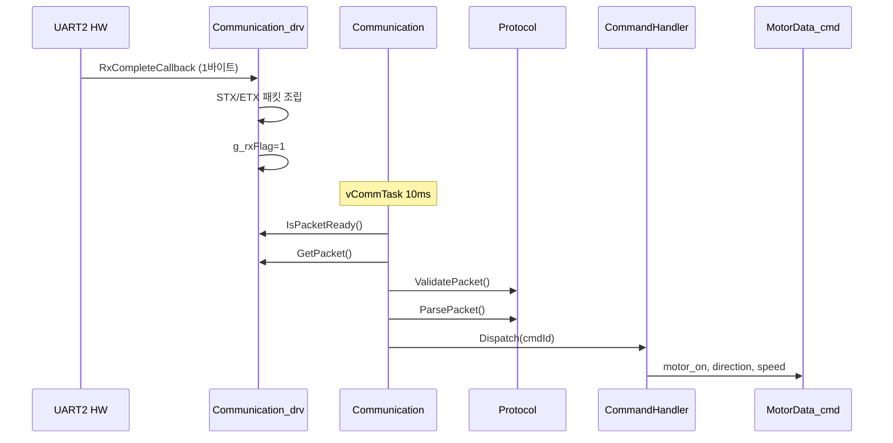
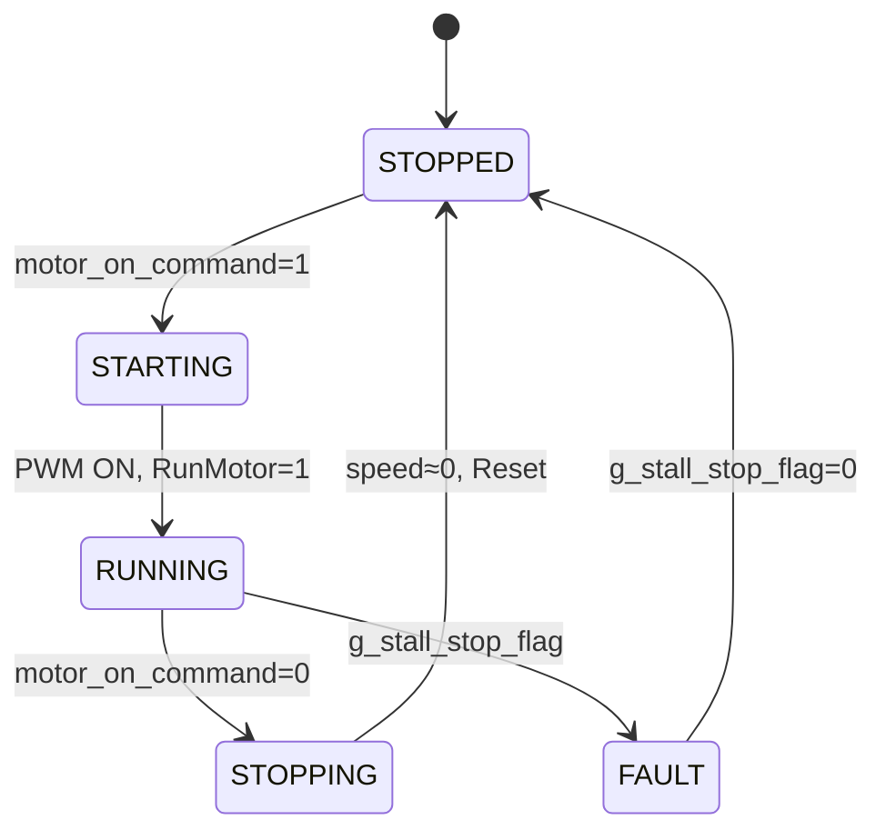

# Chapter 5: 사용자 알고리즘 추가

## 목차

1. [통신 모듈 구현 (Communication, Protocol, CommandHandler)](#1-통신-모듈-구현-communication-protocol-commandhandler)
2. [모터 상태머신 (5-State Machine)](#2-모터-상태머신-5-state-machine)
3. [속도 램프 제어 (50us Timer2)](#3-속도-램프-제어-50us-timer2)
4. [통신 건강 체크 (RX Timeout 1초)](#4-통신-건강-체크-rx-timeout-1초)
5. [Stall 검사 (과전류 감지)](#5-stall-검사-과전류-감지)
6. [LED 상태 표시 (Blinker + Morse)](#6-led-상태-표시-blinker--morse)

---

## 1. 통신 모듈 구현 (Communication, Protocol, CommandHandler)

### 1.1 계층 구조

```
┌─────────────────────────────────────────────────────────────────────────┐
│                     통신 모듈 계층 구조                                   │
├─────────────────────────────────────────────────────────────────────────┤
│                                                                         │
│  Application (pmsm.c)                                                   │
│       │                                                                  │
│       ▼                                                                  │
│  ┌─────────────────┐                                                    │
│  │ Communication   │  Core - 오케스트레이션 (communication)              │
│  │ (Communication.c)│                                                    │
│  └────────┬────────┘                                                    │
│           │                                                              │
│     ┌─────┴─────┬─────────────┬──────────────┐                           │
│     ▼           ▼             ▼              ▼                           │
│  ┌──────┐  ┌──────────┐  ┌──────────┐  ┌──────────────┐                  │
│  │ Drv  │  │ Protocol │  │ Command  │  │ UartTx2      │                  │
│  │ _drv │  │ protocol │  │ _handler │  │ .Send()      │                  │
│  └──────┘  └──────────┘  └──────────┘  └──────────────┘                  │
│     │           │             │                                           │
│     └───────────┴─────────────┴──→ MotorData_cmd (DI)                    │
│                                                                         │
└─────────────────────────────────────────────────────────────────────────┘
```

### 1.2 Communication (Core)

**파일**: `src/comm/Communication.c`

**역할**: 수신 → 검증 → 파싱 → 디스패치 → 응답 전송의 총괄

```c
// Communication.c 65~105행
void communication(void)
{
    if (COMM_Drv_IsPacketReady())
    {
        uint8_t rxLen = COMM_Drv_GetPacket(rxBuffer, COMM_RX_PACKET_LEN);
        PacketValidation_e validation = Protocol.ValidatePacket(rxBuffer, rxLen);

        if (validation == PACKET_OK)
        {
            Protocol.ParsePacket(rxBuffer, rxLen);
            uint8_t cmdId = (Protocol.AsciiToHex(rxBuffer[1]) << 4)
                          | Protocol.AsciiToHex(rxBuffer[2]);
            CommandHandler_Dispatch(cmdId);
            CommandHandler_NotifyRx();
        }
    }

    if (g_timer1ms_comm >= COMM_TX_INTERVAL_MS)  // 100ms
    {
        g_timer1ms_comm = 0;
        uint8_t txLen = Protocol.FormatResponse(txBuffer);
        UartTx2.Send(txBuffer, txLen);
    }

    if (g_healthCheckTimer >= COMM_HEALTH_PERIOD_MS)  // 1초
    {
        g_healthCheckTimer = 0;
        g_commHealthy = (COMM_Drv_GetRxPacketCount() != g_lastRxCount);
        g_lastRxCount = COMM_Drv_GetRxPacketCount();
    }
}
```

### 1.3 Communication_drv (Driver)

**파일**: `src/comm/Communication_drv.c`

**역할**: UART2 HW 바인딩, 패킷 조립, API 제공

```c
// UART2 수신 ISR 콜백 - Communication_drv.c 98~135행
void UART2_RxCompleteCallback(void)
{
    static uint8_t rxAssemblyBuf[COMM_RX_ASSEMBLY_SIZE];
    static uint8_t rxIndex = 0;
    uint8_t rxByte = UART2_Drv_Read();

    rxAssemblyBuf[rxIndex++] = rxByte;

    if (rxAssemblyBuf[0] != COMM_STX)  // 0x40
    {
        rxIndex = 0;
        return;
    }

    if (rxIndex > 3 && rxAssemblyBuf[rxIndex - 3] == COMM_ETX)  // 0x2A
    {
        memcpy(g_rxPacketBuf, rxAssemblyBuf, rxIndex);
        g_rxFlag = RX_FLAG_READY;
        g_rxPacketCount++;
        rxIndex = 0;
    }
}
```

**API**:
- `COMM_Drv_IsPacketReady()`: 패킷 수신 완료 여부
- `COMM_Drv_GetPacket(buf, maxLen)`: 패킷 복사 + 플래그 클리어
- `COMM_Drv_GetRxPacketCount()`: 수신 카운터 (건강 상태용)

### 1.4 Protocol

**파일**: `src/comm/protocol.c`

**역할**: ASCII-hex 파싱, 패킷 검증, 응답 포맷

| 함수 | 용도 |
|------|------|
| `Protocol.ValidatePacket()` | STX/ETX/길이 검증 |
| `Protocol.ParsePacket()` | ASCII-hex → CommandData_t |
| `Protocol.FormatResponse()` | CommandData_t → ASCII-hex TX |
| `Protocol_GetMotorOn()` | motor_on 비트 |
| `Protocol_GetDirection()` | direction 비트 |
| `Protocol_GetSpeed()` | speed 값 |
| `Protocol_SetPresentRpm()` | 현재 RPM (TX용) |

### 1.5 CommandHandler

**파일**: `src/comm/command_handler.c`

**역할**: cmdId → 핸들러 디스패치, MotorData_cmd 갱신

```c
// CommandHandler_RegisterTarget - DI (의존성 주입)
void CommandHandler_RegisterTarget(MotorData_t* pMotor)
{
    g_pMotorTarget = pMotor;
}

// Command_MotorControl - 0x05 명령 핸들러
static void Command_MotorControl(MotorData_t* motorData)
{
    motorData->motor_on   = Protocol_GetMotorOn();
    motorData->direction = Protocol_GetDirection();
    motorData->speed     = Protocol_GetSpeed();
    if (motorData->speed == 0)
        motorData->motor_on = 0;
}
```

### 1.6 통신 흐름 다이어그램



---

## 2. 모터 상태머신 (5-State Machine)

### 2.1 상태 정의

**파일**: `src/motor/motor_statemachine.h`

```c
typedef enum {
    MOTOR_STATE_STOPPED,   // 정지
    MOTOR_STATE_STARTING,  // 기동 중
    MOTOR_STATE_RUNNING,   // 구동 중
    MOTOR_STATE_STOPPING,  // 감속 정지 중
    MOTOR_STATE_FAULT,     // 스톨/에러
    MOTOR_STATE_COUNT
} MotorState_e;
```

### 2.2 상태 전이 다이어그램



### 2.3 ASCII 상태 전이

```
                    motor_on=1
    ┌─────────┐  ───────────────→  ┌──────────┐
    │ STOPPED │                     │ STARTING │
    └─────────┘                     └────┬─────┘
         ↑                               │ 즉시
         │                               ▼
         │                         ┌──────────┐  motor_on=0
         │     speed≈0, Reset       │ RUNNING  │ ──────────→ ┌──────────┐
         └─────────────────────────┤          │             │ STOPPING │
                                   └────┬─────┘             └────┬─────┘
                                        │ stall                  │
                                        ▼                        │
                                   ┌──────────┐                  │
                                   │  FAULT   │ ←────────────────┘
                                   └────┬─────┘
                                        │ stall 해제
                                        ▼
                                   ┌─────────┐
                                   │ STOPPED │
                                   └─────────┘
```

### 2.4 상태 핸들러 구현

**파일**: `src/motor/motor_statemachine.c`

```c
// State_Stopped - 129~135행
static void State_Stopped(void)
{
    if (MotorData_cmd.motor_on_command == 1)
        currentState = MOTOR_STATE_STARTING;
}

// State_Starting - 141~158행
static void State_Starting(void)
{
    CW_CCW = (MotorData_cmd.direction == DIRECTION_FORWARD) ? 0 : 1;
    EnablePWMOutputsInverterA();
    uGF.bits.RunMotor = 1;
    currentState = MOTOR_STATE_RUNNING;
}

// State_Running - 164~173행
static void State_Running(void)
{
    Motor_Speed();
    if (MotorData_cmd.motor_on_command == 0)
        currentState = MOTOR_STATE_STOPPING;
}

// State_Stopping - 179~196행
static void State_Stopping(void)
{
    MotorData_cmd.speed_command = 0;
    if (abs(MotorData_now.speed) <= SPEED_STOP_LIMIT && MotorData_cmd.speed_target == 0)
    {
        uGF.bits.RunMotor = 0;
        taskENTER_CRITICAL();
        MotorControl.Reset();
        taskEXIT_CRITICAL();
        currentState = MOTOR_STATE_STOPPED;
    }
}

// State_Fault - 214~222행
static void State_Fault(void)
{
    if (g_stall_stop_flag == 0)
        currentState = MOTOR_STATE_STOPPED;
}
```

### 2.5 함수포인터 디스패치

```c
// motor_statemachine.c 51~57행
static const StateHandler_fn stateHandlers[MOTOR_STATE_COUNT] = {
    State_Stopped, State_Starting, State_Running,
    State_Stopping, State_Fault,
};

void MotorStateMachine_Execute(void)
{
    // Stall, RX 타임아웃 검사...
    stateHandlers[currentState]();
}
```

---

## 3. 속도 램프 제어 (50us Timer2)

### 3.1 개요

- **주기**: 50µs (Timer2/SCCP1)
- **가속**: +2 rpm/50µs
- **감속**: -10 rpm/50µs (가속의 5배)

**파일**: `src/motor/motor_speed.c`, `src/motor/motor_speed.h`

### 3.2 4-상태 제어

| 상태 | 조건 | 동작 |
|------|------|------|
| 0 | speed_command=0, now_speed≤200 | target=0 유지 |
| 1 | speed_command=0, now_speed>200 | target -= 10 (감속) |
| 2 | speed_command≠0, now_speed>200 | 목표와 비교 가감속 |
| 3 | speed_command≠0, now_speed≤200 | target += 2 (재기동 가속) |

### 3.3 update_speed_target() 구현

**파일**: `src/motor/motor_speed.c` 65~139행

```c
void update_speed_target(void)
{
    static uint8_t control_step = 0;
    int32_t now_speed = abs(MotorData_now.speed);

    // 상태 판정
    if (speed_command == 0 && now_speed <= SPEED_STOP_LIMIT)
        control_step = 0;
    else if (speed_command == 0 && now_speed > SPEED_STOP_LIMIT)
        control_step = 1;  // 감속
    else if (speed_command != 0 && now_speed > SPEED_STOP_LIMIT)
        control_step = 2;  // 구동중
    else if (speed_command != 0 && now_speed <= SPEED_STOP_LIMIT)
        control_step = 3;  // 재기동

    // 상태별 처리
    if (control_step == 0)
        MotorData_cmd.speed_target = 0;
    else if (control_step == 1)
        MotorData_cmd.speed_target -= SPEED_RAMP_DECEL;  // 10
    else if (control_step == 2)
        // 목표와 비교하여 가감속
    else if (control_step == 3)
        MotorData_cmd.speed_target += SPEED_RAMP_ACCEL;  // 2
}
```

### 3.4 Timer2 콜백

**파일**: `src/motor/motor_speed.c` 27~32행

```c
void SpeedRamp_50us_Callback(void)
{
    update_speed_target();
    X2C_VelRef = MotorData_cmd.speed_target;  // DoControl에서 참조
}
```

**등록**: `src/pmsm.c` 150~154행

```c
static void Timer2_Setup(void)
{
    Timer2_Init();
    Timer2_RegisterCallback(SpeedRamp_50us_Callback);
}
```

### 3.5 상수 정의

**파일**: `src/motor/motor_speed.h` 26~28행

```c
#define SPEED_RAMP_ACCEL    2    // 가속: +2rpm/50us
#define SPEED_RAMP_DECEL    10   // 감속: -10rpm/50us
#define SPEED_STOP_LIMIT    200  // 정지 판정 (rpm)
```

---

## 4. 통신 건강 체크 (RX Timeout 1초)

### 4.1 동작 원리

1초 동안 수신 패킷이 없으면 `g_commHealthy = false`로 설정하고, 모터 상태머신에서 `motor_on_command = 0`으로 강제하여 모터를 정지시킵니다.

### 4.2 구현

**Communication.c**:
```c
// 1초 주기 판단
if (g_healthCheckTimer >= COMM_HEALTH_PERIOD_MS)  // 1000
{
    g_healthCheckTimer = 0;
    g_commHealthy = (COMM_Drv_GetRxPacketCount() != g_lastRxCount);
    g_lastRxCount = COMM_Drv_GetRxPacketCount();
}
```

**motor_statemachine.c**:
```c
void MotorStateMachine_Execute(void)
{
    // ...
    if (!Communication_IsHealthy())
    {
        MotorData_cmd.motor_on_command = 0;  // 강제 정지
    }
    // ...
}
```

### 4.3 흐름도

```
SW Timer 1ms → timer1ms_communication() → g_healthCheckTimer++

vCommTask 10ms → communication()
    └─ g_healthCheckTimer >= 1000
        └─ g_commHealthy = (rxCount != lastRxCount)
        └─ g_lastRxCount = rxCount

vMotorTask 1ms → MotorStateMachine_Execute()
    └─ Communication_IsHealthy() == false
        └─ motor_on_command = 0 → STOPPING
```

---

## 5. Stall 검사 (과전류 감지)

### 5.1 검사 위치

**ADC ISR** (`src/pmsm.c` 366~396행) - FOC 실행 **직전** 선행 검사

### 5.2 임계값

| 조건 | 동작 |
|------|------|
| Ia > 10000 또는 Ib > 10000 | 즉시 Reset, g_stall_stop_flag=1 |
| Ia > 8000 또는 Ib > 8000 | STALL_CNT++ |
| Ia < 7500 및 Ib < 7500 | STALL_CNT=0 |
| STALL_CNT > 130 | Reset, g_stall_stop_flag=1 |

### 5.3 소스 코드

```c
// pmsm.c 366~396행
#ifdef STALL_STOP
if (measureInputs.current.Ia > 10000 || measureInputs.current.Ib > 10000)
{
    MotorControl.Reset();
    g_stall_stop_flag = 1;
    STALL_CNT = 0;
    goto adc_isr_tail;
}

if (measureInputs.current.Ia > 8000 || measureInputs.current.Ib > 8000)
    STALL_CNT++;
else if (measureInputs.current.Ia < 7500 && measureInputs.current.Ib < 7500)
    STALL_CNT = 0;

if (STALL_CNT > 130)
{
    MotorControl.Reset();
    g_stall_stop_flag = 1;
    STALL_CNT = 0;
    goto adc_isr_tail;
}
#endif
```

### 5.4 상태머신 연동

```c
// motor_statemachine.c 86~98행
if (g_stall_stop_flag != 0)
{
    MotorData_cmd.motor_on_command = 0;
    if (currentState != MOTOR_STATE_FAULT && currentState != MOTOR_STATE_STOPPED)
    {
        MotorData_cmd.speed_command = 0;
        MotorData_cmd.speed_target = 0;
        X2C_VelRef = 0;
        currentState = MOTOR_STATE_FAULT;
    }
    if (MotorData_cmd.motor_on == 0)
        g_stall_stop_flag = 0;
}
```

---

## 6. LED 상태 표시 (Blinker + Morse)

### 6.1 구조

```
┌─────────────────────────────────────────────────────────────────┐
│                    LED 표시 구조                                  │
├─────────────────────────────────────────────────────────────────┤
│                                                                 │
│  vUITask (10ms)                                                 │
│       │                                                         │
│       ├─ LedMorse.Update()  ← 모터 구동 시 RPM 모르스부호        │
│       │       │                                                 │
│       │       └─ provider: MotorStateMachine_GetSetRPM          │
│       │                                                         │
│       └─ LedBlinker.Update()  ← idle 시 통신 상태 점멸           │
│               │                                                 │
│               └─ provider: Communication_IsHealthy               │
│                                                                 │
│  SW Timer 1ms → LedBlinker.TimerISR(), LedMorse.TimerISR()      │
│                                                                 │
└─────────────────────────────────────────────────────────────────┘
```

### 6.2 LedBlinker

**파일**: `src/ui/led_blinker.c`

- **전략**: 정상(Communication_IsHealthy=true) / 에러(false) 자동 전환
- **상태머신**: INIT → ON → ON_WAIT → OFF_WAIT → (반복 or PAUSE)
- **1초 주기**: statusProvider 콜백으로 전략 갱신

```c
// pmsm.c 135~138행
LedBlinker_SetHwOps(LedBlinker_Drv_GetHwOps());
LedBlinker_SetAutoStrategies(&LED_STRATEGY_NORMAL, &LED_STRATEGY_ERROR);
LedBlinker.Init();
LedBlinker.RegisterProvider(Communication_IsHealthy);
```

### 6.3 LedMorse

**파일**: `src/ui/led_morse.c`

- **표시**: 모터 구동 시 설정 RPM을 모르스부호로 표시 (천단위 절삭)
- **규칙**: dot=150ms, dash=450ms, 요소간격=150ms
- **provider**: `MotorStateMachine_GetSetRPM()` (정지 시 -1 → idle)

```c
// pmsm.c 139~142행
LedMorse_SetHwOps(LedBlinker_Drv_GetHwOps());
LedMorse.Init();
LedMorse.RegisterProvider(MotorStateMachine_GetSetRPM);
```

### 6.4 우선순위

```c
// pmsm.c 227~230행
if (!LedMorse.Update())   // Morse 우선 (구동 시)
    LedBlinker.Update();  // idle이면 Blinker (통신 상태)
```

---

**이전**: [← Chapter 4: FreeRTOS 실시간 시스템](04_FreeRTOS_structure.md)  
**다음**: [Chapter 6: 구현 중 발생한 문제와 해결 →](06_problems_solutions.md)
