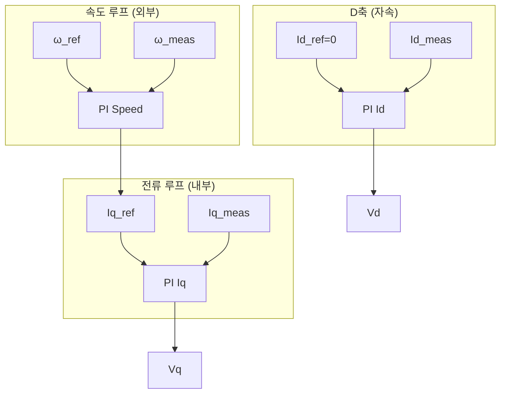

# Chapter 9: PID 튜닝 가이드 (PID Tuning Guide)

## 목차

1. [PID 제어 기초 이론](#1-pid-제어-기초-이론)
2. [목표에 따른 튜닝 전략](#2-목표에-따른-튜닝-전략)
3. [체계적인 튜닝 방법](#3-체계적인-튜닝-방법)
4. [Microchip Excel 계산기 활용](#4-microchip-excel-계산기-활용)
5. [실전 튜닝 절차 (본 프로젝트 기준)](#5-실전-튜닝-절차-본-프로젝트-기준)
6. [성능 평가 지표](#6-성능-평가-지표)
7. [문제 해결 (증상별)](#7-문제-해결-증상별)
8. [X2CScope를 활용한 실시간 튜닝](#8-x2cscope를-활용한-실시간-튜닝)
9. [본 프로젝트의 튜닝 결과](#9-본-프로젝트의-튜닝-결과)

---

## 1. PID 제어 기초 이론

### 1.1 PID 제어기의 역할

PID 제어기는 **비례(Proportional)**, **적분(Integral)**, **미분(Derivative)** 세 가지 항을 조합하여 피드백 제어를 수행합니다. 목표값(Reference)과 측정값(Feedback)의 오차(Error)를 입력으로 받아 제어 출력을 생성합니다.

#### 제어 출력 수식

$$
u(t) = K_p \cdot e(t) + K_i \int e(\tau) d\tau + K_d \frac{de(t)}{dt}
$$

또는 이산형(Discrete Form)으로:

$$
u[k] = K_p \cdot e[k] + K_i \cdot T_s \sum_{i=0}^{k} e[i] + K_d \frac{e[k] - e[k-1]}{T_s}
$$

여기서:
- \( e(t) = r(t) - y(t) \) : 오차 (목표값 - 측정값)
- \( T_s \) : 샘플링 주기 (본 프로젝트: 50µs)
- \( K_p, K_i, K_d \) : 각각 비례, 적분, 미분 이득

---

### 1.2 P, I, D 각 항의 물리적 의미

#### P항 (Proportional, 비례)

$$
u_P = K_p \cdot e
$$

| 특성 | 설명 |
|------|------|
| **물리적 의미** | 오차에 비례하여 즉각 반응. 오차가 클수록 출력이 큼 |
| **효과** | 응답 속도 향상, 오차 감소 |
| **단점** | 과다 시 오버슈트·발진, 부족 시 정상상태 오차(Steady-State Error) 존재 |
| **비유** | 자동차 핸들: 목표 방향에서 벗어나면 그만큼 더 꺾음 |

```
오차 e(t)
    ↑
    │     ╱╲
    │    ╱  ╲
    │   ╱    ╲________
    │  ╱
    └──────────────────→ 시간
         P항 출력 ∝ e
```

#### I항 (Integral, 적분)

$$
u_I = K_i \int e \, dt
$$

| 특성 | 설명 |
|------|------|
| **물리적 의미** | 과거 오차의 누적. 지속적인 오차를 제거 |
| **효과** | 정상상태 오차 제거 (Zero Steady-State Error) |
| **단점** | 과다 시 오버슈트, Integral Windup(적분 포화) |
| **비유** | 누적된 편차를 보정: 오차가 남아있으면 계속 보정력 증가 |

```
오차 e(t)
    ↑
    │  ┌─────
    │  │
    │  │  ← 작은 오차가 지속되면
    │  │     적분값이 누적됨
    └──┴──────────────────→ 시간
         I항: ∫e·dt
```

#### D항 (Derivative, 미분)

$$
u_D = K_d \frac{de}{dt}
$$

| 특성 | 설명 |
|------|------|
| **물리적 의미** | 오차 변화율에 반응. "앞으로 갈 추세" 예측 |
| **효과** | 오버슈트 억제, 댐핑(Damping) 증가 |
| **단점** | 노이즈에 매우 민감, 고주파 증폭 |
| **비유** | 오차가 빠르게 줄어들면 미리 브레이크를 밟음 |

```
오차 e(t)
    ↑
    │  ╲
    │   ╲  ← de/dt < 0 (감소 중)
    │    ╲   D항이 제동력 제공
    │     ╲___
    └──────────────→ 시간
```

---

### 1.3 FOC에서의 3중 PI 제어 구조 (Id, Iq, Speed)

FOC(Field Oriented Control)에서는 **캐스케이드 제어(Cascade Control)** 구조를 사용합니다. 외부 루프(속도)가 내부 루프(전류)의 참조값을 설정합니다.

```
┌─────────────────────────────────────────────────────────────────────────────┐
│                    FOC 3중 PI 제어 캐스케이드 구조                            │
├─────────────────────────────────────────────────────────────────────────────┤
│                                                                             │
│   ω_ref (속도 참조)                                                         │
│        │                                                                     │
│        ▼                                                                     │
│   ┌─────────────┐     Iq_ref      ┌─────────────┐     Vq      ┌──────────┐  │
│   │ PI Speed    │ ───────────────→ │ PI Iq       │ ─────────→  │  모터   │  │
│   │ (가장 느림)  │                  │ (빠름)      │             │  (식)   │  │
│   └─────────────┘                  └─────────────┘             │          │  │
│        ▲                                ▲                     │  Id,Iq   │  │
│        │                                │                     │    ↓     │  │
│   ω_meas (추정)                    Iq_meas (측정)              │  Clarke │  │
│   (BEMF 추정기)                   (Park 변환)                  │  Park   │  │
│                                                                 └──────────┘  │
│   Id_ref = 0 (Field Weakening 미사용 시)                                     │
│        │                                                                     │
│        ▼                                                                     │
│   ┌─────────────┐     Vd      ┌──────────┐                                   │
│   │ PI Id       │ ─────────→  │  역 Park │                                   │
│   │ (빠름)      │             │  SVPWM   │                                   │
│   └─────────────┘             └──────────┘                                   │
│        ▲                                                                     │
│        │                                                                     │
│   Id_meas (측정)                                                             │
│                                                                             │
└─────────────────────────────────────────────────────────────────────────────┘
```

#### Mermaid: 캐스케이드 제어 흐름



#### 루프별 역할

| 루프 | 입력 | 출력 | 주기 | 역할 |
|------|------|------|------|------|
| **Id (d축 전류)** | Id_ref, Id_meas | Vd | 50µs | 자속 제어 (본 프로젝트: Id_ref=0) |
| **Iq (q축 전류)** | Iq_ref, Iq_meas | Vq | 50µs | 토크 제어 (속도 루프의 내부 루프) |
| **Speed (속도)** | ω_ref, ω_meas | Iq_ref | 50µs×N | 속도 제어 (가장 외부 루프) |

> **참고**: 속도 루프는 `SPEEDREFRAMP_COUNT`에 따라 3 ADC 사이클마다 실행될 수 있음 (userparms.h: `SPEEDREFRAMP_COUNT 3`)

#### 대역폭 분리 원칙 (Bandwidth Separation)

캐스케이드 제어에서 **내부 루프는 외부 루프보다 5~10배 빠르게** 설계합니다.

```
대역폭:  Speed << Iq ≈ Id
         (예: 100Hz)   (예: 500~1000Hz)
```

이유: 외부 루프가 "내부 루프가 이미 완벽하게 추종한다"고 가정할 수 있어야 하므로, 내부 루프가 훨씬 빠르게 설계됩니다.

---

### 1.4 PI vs PID (D항을 사용하지 않는 이유)

본 프로젝트(AN1292) 및 대부분의 FOC 구현에서는 **PI 제어기**만 사용합니다. D항을 생략하는 이유는 다음과 같습니다.

#### 1) 노이즈에 대한 민감도 (Noise Sensitivity)

$$
u_D = K_d \frac{de}{dt}
$$

- 미분은 **고주파 성분을 증폭**함
- 전류 ADC, 속도 추정기(BEMF)에는 노이즈가 포함됨
- \( K_d \) 증가 시 노이즈가 심하게 증폭되어 제어 불안정

```
노이즈가 있는 신호 e(t)
    ↑
    │  ∿∿∿∿∿∿∿∿∿∿
    │  ∿  ∿  ∿  ∿  ← de/dt는 급격한 변화
    │  ∿∿∿∿∿∿∿∿∿∿     → 노이즈 증폭!
    └──────────────────→ 시간
```

#### 2) 샘플링 주기와 미분의 한계

- 50µs 샘플링에서 \( \frac{e[k]-e[k-1]}{T_s} \)는 **매우 큰 값**이 될 수 있음
- 두 샘플 간 작은 오차 변화도 큰 미분값으로 변환
- 저역통과필터(LPF)를 추가하면 D항의 효과가 감소

#### 3) PI만으로 충분한 성능

- 전류 루프: 1차 시스템 특성 → PI로 정상상태 오차 제거 가능
- 속도 루프: 전류 루프가 충분히 빠르면 PI만으로도 양호한 응답
- **Anti-windup (Kc)** 와 **적절한 Kp, Ki** 조합으로 오버슈트 제어 가능

#### 4) 구현 복잡도

- dsPIC 어셈블리 PI 루틴(`MC_ControllerPIUpdate_Assembly`)은 PI만 지원
- D항 추가 시 별도 구현 및 검증 필요

---

## 2. 목표에 따른 튜닝 전략

튜닝 전 **목표를 명확히** 하는 것이 중요합니다. 목표에 따라 Kp, Ki의 비율과 절대값이 달라집니다.

### 2.1 빠른 응답 (Fast Response)

| 목표 | 전략 | Kp | Ki | 트레이드오프 |
|------|------|-----|-----|-------------|
| **빠른 Settling Time** | Kp 크게 | ↑↑ | ↑ | 오버슈트 증가, 노이즈 증폭 |
| **빠른 Rise Time** | 초기 반응 강화 | ↑↑ | 보통 | 발진 위험 |

```
목표값
    ↑
    │         _______________
    │        ╱
    │       ╱  ← 오버슈트 허용
    │      ╱
    │_____╱
    └────────────────────────→ 시간
         ↑
      빠른 정착
```

**적용 예**: 급가속이 필요한 드릴, 임팩트 드라이버

---

### 2.2 안정적 제어 (Stable Control)

| 목표 | 전략 | Kp | Ki | 트레이드오프 |
|------|------|-----|-----|-------------|
| **오버슈트 최소화** | Kp 보수적 | ↓ | ↓ | 응답 느림 |
| **발진 방지** | 여유 있는 이득 | ↓ | ↓ | 정착 시간 증가 |

```
목표값
    ↑
    │     _______________
    │    ╱
    │   ╱  ← 오버슈트 거의 없음
    │  ╱
    │_╱
    └────────────────────────→ 시간
         ↑
      느리지만 안정적
```

**적용 예**: 의료 기기, 정밀 포지셔닝

---

### 2.3 고효율 (High Efficiency)

| 목표 | 전략 | Kp | Ki | 트레이드오프 |
|------|------|-----|-----|-------------|
| **리플 최소화** | 전류 루프 Kp 적정 | 적정 | 적정 | 과도한 Kp는 스위칭 손실 증가 |
| **부드러운 제어** | 속도 루프 Kp 낮게 | ↓ | ↓ | 동적 응답 희생 |

- **전류 리플**: PWM 주파수(20kHz) 대비 전류 루프 대역폭이 낮으면 리플 증가
- **토크 리플**: Iq 리플 → 기계적 진동, 소음

**적용 예**: 배터리 구동, 저소음 요구

---

### 2.4 정밀 제어 (Precision Control)

| 목표 | 전략 | Kp | Ki | 트레이드오프 |
|------|------|-----|-----|-------------|
| **정상상태 오차 최소화** | Ki 충분히 | 보통 | ↑↑ | Integral Windup 주의 |
| **오차 제거** | Anti-windup(Kc) 조정 | - | - | Kc↓ → Windup 완화 느림 |

```
목표값
    ↑
    │  ─────────────────
    │  ↑
    │  │ 정상상태 오차 ≈ 0
    │  │ (Ki가 누적 보정)
    └──┴──────────────────→ 시간
```

**적용 예**: CNC, 로봇 관절, 본 프로젝트(치과 기구)

---

## 3. 체계적인 튜닝 방법

### 3.1 Ziegler-Nichols 방법

1942년 Ziegler와 Nichols가 제안한 고전적 튜닝법입니다.

#### 3.1.1 한계 이득법 (Ultimate Gain Method)

**절차**:
1. Ki = 0, Kd = 0으로 설정
2. Kp만 증가시키며 **발진이 시작되는** Kp = \( K_u \) (Ultimate Gain) 찾기
3. 발진 주기 \( T_u \) (Ultimate Period) 측정
4. 아래 표에 따라 초기값 설정

| 제어기 | Kp | Ki | Kd |
|--------|-----|-----|-----|
| P | 0.5·Ku | - | - |
| PI | 0.45·Ku | 1.2·Kp/Tu | - |
| PID | 0.6·Ku | 2·Kp/Tu | Kp·Tu/8 |

**수식**:
$$
K_p = 0.45 \cdot K_u, \quad T_i = 0.83 \cdot T_u, \quad K_i = \frac{K_p}{T_i}
$$

#### dsPIC FOC 적용 시 주의사항

- **전류 루프**: 20kHz에서 매우 빠르게 발진할 수 있음 → 과전류 보호 확인
- **속도 루프**: BEMF 추정기 지연으로 \( T_u \)가 길 수 있음
- **실제 적용**: Z-N은 **초기값**만 제공. 미세 조정 필수

---

#### 3.1.2 계단 응답법 (Step Response Method)

**절차**:
1. 개루프(Open Loop)에서 계단 입력 인가
2. S자 곡선에서 **시정수 τ**, **지연 시간 L** 측정
3. 비율 \( R = L/τ \) 계산
4. 아래 표 적용

| 제어기 | Kp | Ti | Td |
|--------|-----|-----|-----|
| P | 1/R | - | - |
| PI | 0.9/R | 3.33L | - |
| PID | 1.2/R | 2L | 0.5L |

```
응답 y(t)
    ↑
    │              ________
    │             ╱
    │            ╱
    │           ╱
    │    ______╱
    │   ╱
    │__╱
    └──┴──┴──────────────→ 시간
        L   τ
        ↑   ↑
     지연  시정수
```

---

### 3.2 Cohen-Coon 방법

FOPDT(First Order Plus Dead Time) 모델을 가정한 튜닝법입니다.

**FOPDT 모델**:
$$
G(s) = \frac{K}{\tau s + 1} e^{-Ls}
$$

- K: 정상상태 이득
- τ: 시정수
- L: 지연 시간

**PI 계수** (Cohen-Coon):
$$
K_p = \frac{1}{K} \frac{\tau}{L} \left( 0.9 + \frac{L}{12\tau} \right)
$$
$$
T_i = L \frac{30 + 3(L/\tau)}{9 + 20(L/\tau)}, \quad K_i = \frac{K_p}{T_i}
$$

**특징**: 지연이 큰 시스템에 Z-N보다 나은 결과를 줄 수 있음.

---

### 3.3 Relay Feedback 방법

**자동 튜닝** 개념으로, 릴레이(히스테리시스)를 피드백에 삽입하여 임계 주파수를 찾습니다.

```
     +     ┌─────────┐     ┌─────────┐     ┌─────────┐
r ────┼───→│ Relay   │────→│  Plant  │────→│  ─1     │───┐
     -     │ (hyster)│     │ (모터)  │     │ (피드백)│   │
           └─────────┘     └─────────┘     └─────────┘   │
                 ↑                              │         │
                 └──────────────────────────────┴─────────┘
```

**절차**:
1. Relay 출력으로 시스템이 **자동 발진**
2. 발진 주파수 \( \omega_u \) ≈ 임계 주파수
3. 발진 진폭으로 \( K_u \) 추정
4. Z-N 공식 적용

**장점**: 개루프 계단 응답 없이 자동으로 \( K_u \), \( T_u \) 획득

---

### 3.4 수동 튜닝 체계적 접근

실무에서 가장 많이 사용하는 방법입니다.

#### 3.4.1 전류 루프 (Id, Iq) 튜닝

**순서**:

```
Step 1: Kp만 증가
        ├─ Ki = 0
        ├─ 응답 속도 확인
        └─ 발진 직전까지 Kp 증가

Step 2: Ki 추가
        ├─ 정상상태 오차 제거
        └─ Ki를 소량부터 증가

Step 3: Anti-windup Kc 조정
        ├─ 포화 시 적분기 누적 완화
        └─ Kc ≈ 0.9~0.999 (본 프로젝트: 0.999)
```

**전류 루프 특성**:
- 1차 지연 시스템: \( G(s) \approx \frac{1}{R_s + L_s s} \)
- 대역폭 목표: PWM 주파수의 1/5 ~ 1/10 (2~4kHz)
- 너무 높으면 노이즈 증폭, 스위칭 손실 증가

#### 3.4.2 속도 루프 튜닝

**전제 조건**: 전류 루프가 **안정화된 후** 시작

**순서**:

```
Step 1: 전류 루프 안정화
        └─ Id, Iq PI가 목표 전류를 잘 추종하는지 확인

Step 2: Kp 증가
        ├─ 속도 계단 응답 관찰
        └─ 오버슈트가 허용 범위 내인지 확인

Step 3: Ki 추가
        ├─ 속도 정상상태 오차 제거
        └─ 부하 변동 시 속도 유지

Step 4: 오버슈트 제어
        ├─ Kp 감소 또는 Ki 감소
        └─ SPEEDREFRAMP로 가감속 완화
```

**속도 루프 대역폭**: 전류 루프의 1/5~1/10 (100~500Hz)

---

## 4. Microchip Excel 계산기 활용

### 4.1 AN1292 제공 Excel 파일

AN1292 Application Note에는 모터 파라미터를 입력하면 **PI 계수를 자동 계산**하는 Excel 파일이 동봉되어 있습니다.

> **참고**: 프로젝트 루트에 xls 파일이 없을 수 있음. Microchip AN1292 패키지 또는 [Microchip 웹사이트](https://www.microchip.com)에서 다운로드

### 4.2 모터 파라미터 입력

Excel 시트에 다음 값을 입력합니다:

| 파라미터 | 설명 | 단위 | 측정/계산 방법 |
|----------|------|------|----------------|
| **Rs** | 상 저항 (Stator Resistance) | Ω | LCR 미터, 또는 전압/전류 비율 |
| **Ls** | 상 인덕턴스 (Stator Inductance) | H | LCR 미터 |
| **Ke** | 역기전력 상수 (Back-EMF Constant) | V/(rad/s) | 데이터시트 또는 측정 |
| **J** | 관성 모멘트 (Inertia) | kg·m² | 데이터시트 또는 추정 |
| **극쌍수** | Pole Pairs | - | 데이터시트 |
| **PWM 주파수** | - | Hz | 20000 |
| **제어 주기** | Ts | s | 0.00005 (50µs) |

### 4.3 계산된 값의 의미

Excel은 보통 다음을 출력합니다:
- **NORM_RS**, **NORM_LSDTBASE**, **NORM_INVKFIBASE**: 정규화된 모터 상수 (Q15 형식)
- **Kp**, **Ki**: PI 제어기 계수 (실수)
- **D_ILIMIT_HS**, **D_ILIMIT_LS**: 전류 변화율 제한

### 4.4 미세 조정

- Excel 결과는 **이론적 초기값**입니다.
- 실제 하드웨어(노이즈, 데드타임, 비선형성)에 따라 **10~30% 조정**이 필요합니다.
- `userparms.h`의 `Q15()` 매크로로 변환:
  ```c
  #define D_CURRCNTR_PTERM  Q15(0.045)   // Excel: 0.045
  #define D_CURRCNTR_ITERM  Q15(0.003)   // Excel: 0.003
  ```

---

## 5. 실전 튜닝 절차 (본 프로젝트 기준)

### Step 1: 모터 파라미터 측정

#### 필요 파라미터

| 파라미터 | 기호 | 설명 | userparms.h 대응 |
|----------|------|------|------------------|
| **상 저항** | Rs | 권선 저항 | NORM_RS |
| **상 인덕턴스** | Ls | 권선 인덕턴스 | NORM_LSDTBASE |
| **역기전력 상수** | Ke | BEMF/속도 | NORM_INVKFIBASE |
| **관성 모멘트** | J | 로터 관성 | (속도 루프 튜닝에 영향) |
| **극쌍수** | Np | Pole Pairs | NOPOLESPAIRS |

#### 측정 방법 (간략)

- **Rs**: LCR 미터로 상간 저항 측정 후 ÷2 (Y연결 기준)
- **Ls**: LCR 미터, 1kHz에서 측정
- **Ke**: \( K_e = \frac{V_{line}}{\omega_m} \) (정격 전압/정격 각속도)

---

### Step 2: 전류 루프 튜닝

#### userparms.h 수정

```c
// userparms.h - 전류 루프 시작값
#define D_CURRCNTR_PTERM       Q15(0.05)    // Kp: 보수적으로 시작
#define D_CURRCNTR_ITERM       Q15(0.008)   // Ki: 소량
#define D_CURRCNTR_CTERM       Q15(0.999)   // Anti-windup
#define D_CURRCNTR_OUTMAX      0x7FFF

#define Q_CURRCNTR_PTERM       Q15(0.05)
#define Q_CURRCNTR_ITERM       Q15(0.008)
#define Q_CURRCNTR_CTERM       Q15(0.999)
#define Q_CURRCNTR_OUTMAX      0x7FFF
```

#### 튜닝 절차

1. **Open Loop 모드**에서 전류 파형 확인
   - `#define OPEN_LOOP_FUNCTIONING` 또는 Open Loop 구간에서 Id, Iq 파형 관찰
   - X2CScope로 `idq.d`, `idq.q` 모니터링

2. **Kp 증가** → 전류 추종 속도 향상
   - 0.03 → 0.05 → 0.07 순으로 증가
   - 발진/리플이 심해지면 직전 값으로 복귀

3. **Ki 추가** → 정상상태 오차 제거
   - 0.001 → 0.003 → 0.008 순으로 증가
   - 오버슈트가 커지면 Ki 감소

4. **리플/노이즈 관찰** → 과도하면 Kp 감소
   - 전류 리플이 크면: Kp 과다 또는 ADC 노이즈

---

### Step 3: 속도 루프 튜닝

#### userparms.h 수정

```c
#define SPEEDCNTR_PTERM        Q15(0.4)
#define SPEEDCNTR_ITERM        Q15(0.003)
#define SPEEDCNTR_CTERM        Q15(0.999)
#define SPEEDCNTR_OUTMAX       Q15_PI_SPEED_OUTPUT_LIMIT
```

#### 튜닝 절차

1. **Closed Loop 전환** 확인
   - Open Loop → Closed Loop 전환이 정상인지 (END_SPEED_RPM = 400)

2. **계단 입력 인가** (속도 변화)
   - 통신으로 속도 명령 변경 (예: 5000 RPM → 15000 RPM)
   - 또는 `#define TUNING`으로 램프 업 테스트

3. **오버슈트, 정착 시간 관찰**
   - X2CScope: `estimator.qVelEstim`, `ctrlParm.targetSpeed`
   - 오버슈트 크면: Kp 감소
   - 정착 느리면: Kp 또는 Ki 증가

4. **반복 조정**
   - 속도 리플이 크면: SPEEDCNTR_PTERM 감소
   - 부하 변동 시 속도 떨어짐: SPEEDCNTR_ITERM 증가

---

## 6. 성능 평가 지표

### 6.1 정의

| 지표 | 영문 | 정의 | 수식/도식 |
|------|------|------|-----------|
| **오버슈트** | Overshoot | 목표값 대비 초과량 | \( OS\% = \frac{y_{max} - y_{ss}}{y_{ss}} \times 100 \) |
| **정착 시간** | Settling Time (Ts) | ±5% 이내 도달 시간 | \( \|y(t) - y_{ss}\| \leq 0.05 y_{ss} \) |
| **상승 시간** | Rise Time (Tr) | 10%→90% 도달 시간 | \( t_{90\%} - t_{10\%} \) |
| **정상상태 오차** | Steady-State Error | 최종 오차 | \( e_{ss} = r - y(\infty) \) |

### 6.2 시각적 표현

```
응답 y(t)
    ↑
    │                    ┌──────────── ±5% 띠
    │         ╱╲         │
    │        ╱  ╲        │
    │       ╱    ╲       │
    │      ╱      ╲______│______  y_ss (정상상태)
    │     ╱  ↑     ↑
    │    ╱   │     └─ Settling Time (Ts)
    │   ╱    └─ Overshoot
    │__╱
    └──┴──┴──────────────────────→ 시간
       Tr
       ↑
    Rise Time
```

### 6.3 목표값 예시 (참고)

| 응용 | 오버슈트 | 정착 시간 | 정상상태 오차 |
|------|----------|-----------|---------------|
| 일반 모터 | < 20% | < 100ms | < 1% |
| 정밀 제어 | < 5% | < 200ms | < 0.1% |
| 빠른 응답 | < 30% 허용 | < 50ms | < 2% |

---

## 7. 문제 해결 (증상별)

| 증상 | 원인 | 해결 |
|------|------|------|
| **발진 (Oscillation)** | Kp 과다 | Kp 감소 (10~20%씩) |
| **느린 응답** | Kp 부족 | Kp 증가 |
| **정상상태 오차 존재** | Ki 부족 | Ki 증가 |
| **Integral Windup** | Ki 과다, 포화 시 적분 누적 | Ki 감소, Kc(CTERM) 조정 (0.9~0.99) |
| **전류 리플** | 전류 루프 대역폭 부족 | 전류 Kp 증가 (노이즈 확인 후) |
| **속도 리플** | 속도 루프 대역폭 과다 | 속도 Kp 감소 |
| **Open Loop 전환 실패** | END_SPEED_RPM 부적절, 추정기 불안정 | END_SPEED_RPM 조정, INITOFFSET_TRANS_OPEN_CLSD 미세 조정 |
| **Stall (과전류)** | 부하 과다, Kp 과다로 급격한 전류 | Q15_OVER_CURRENT_THRESHOLD 확인, Kp 보수적 설정 |

---

## 8. X2CScope를 활용한 실시간 튜닝

### 8.1 X2CScope 개요

X2CScope는 **실시간 변수 모니터링** 및 **파라미터 변경**이 가능한 도구입니다. UART를 통해 PC와 통신합니다.

- **위치**: `lib/x2c_scope/`
- **통신**: UART1 (diagnostics_x2cscope.c)
- **보드레이트**: 115.7kbaud (X2C_BAUDRATE_DIVIDER 54)

### 8.2 설정 방법

1. **MPLAB X에서 X2CScope 플러그인** 활성화
2. **UART1**이 X2CScope 전용으로 사용됨 (UART2는 사용자 통신)
3. **Scope_Main** 블록에 모니터링할 변수 등록
   - 예: `idq.d`, `idq.q`, `estimator.qVelEstim`, `ctrlParm.targetSpeed`, `vdq.d`, `vdq.q`

### 8.3 실시간 파라미터 조정

- X2CScope를 통해 **런타임에 Kp, Ki 변경**이 가능한 경우 (구현에 따라 다름)
- 일반적으로는 **코드 수정 → 빌드 → 다운로드** 반복

### 8.4 파형 관찰 및 분석

**권장 모니터링 변수**:

| 변수 | 설명 | 용도 |
|------|------|------|
| `idq.d`, `idq.q` | d/q축 전류 | 전류 루프 추종 확인 |
| `estimator.qVelEstim` | 추정 속도 | 속도 루프 응답 |
| `ctrlParm.targetSpeed` | 목표 속도 | 참조와 비교 |
| `vdq.d`, `vdq.q` | d/q축 전압 | PI 출력 확인 |

**호출 구조**:
- `DiagnosticsStepMain()`: 메인 루프에서 `X2CScope_Communicate()` 호출
- `DiagnosticsStepIsr()`: ISR에서 `X2CScope_Update()` 호출

---

## 9. 본 프로젝트의 튜닝 결과

### 9.1 사용된 최종 PI 계수값

**파일**: `src/foc/userparms.h`

| 루프 | Kp | Ki | Kc | outMax |
|------|------|------|------|--------|
| **D (Id)** | 0.045 | 0.003 | 0.999 | 0x7FFF |
| **Q (Iq)** | 0.045 | 0.003 | 0.999 | 0x7FFF |
| **Speed** | 0.4 | 0.003 | 0.999 | Q15_PI_SPEED_OUTPUT_LIMIT |

```c
#define D_CURRCNTR_PTERM       Q15(0.045)
#define D_CURRCNTR_ITERM       Q15(0.003)
#define D_CURRCNTR_CTERM       Q15(0.999)
#define D_CURRCNTR_OUTMAX      0x7FFF

#define Q_CURRCNTR_PTERM       Q15(0.045)
#define Q_CURRCNTR_ITERM       Q15(0.003)
#define Q_CURRCNTR_CTERM       Q15(0.999)
#define Q_CURRCNTR_OUTMAX      0x7FFF

#define SPEEDCNTR_PTERM        Q15(0.4)
#define SPEEDCNTR_ITERM        Q15(0.003)
#define SPEEDCNTR_CTERM        Q15(0.999)
#define SPEEDCNTR_OUTMAX       Q15_PI_SPEED_OUTPUT_LIMIT
```

### 9.2 선택 이유 및 트레이드오프

| 항목 | 선택 | 이유 |
|------|------|------|
| **전류 Kp=0.045** | 보수적 | Kp=0.05에서 리플/노이즈가 다소 관찰됨. 0.045로 안정성 우선 |
| **전류 Ki=0.003** | 적정 | 정상상태 오차 제거에 충분, Windup 위험 낮음 |
| **속도 Kp=0.4** | 적극적 | Kp=0.1(주석 처리된 초기값)보다 응답 개선. 치과 기구의 빠른 반응 필요 |
| **속도 Ki=0.003** | 전류와 동일 | 속도 오차 제거, 부하 변동 보상 |
| **Kc=0.999** | 표준 | Anti-windup으로 포화 시 적분기 완만한 감쇠 |

### 9.3 성능 특성

- **전류 루프**: Id, Iq 목표 추종 양호, 20kHz에서 리플 허용 범위
- **속도 루프**: Open Loop → Closed Loop 전환 안정 (END_SPEED_RPM=400)
- **가감속**: SPEEDREFRAMP, 비대칭 램프로 부드러운 구동
- **Stall 대응**: 과전류 시 정지 및 재기동 로직 적용

### 9.4 대안 설정 (주석 처리된 값)

```c
// 이전 시도값 (userparms.h 주석)
// D/Q: Kp=0.05, Ki=0.008  → 더 공격적, 리플 증가
// Speed: Kp=0.1, Ki=0.001 → 더 보수적, 응답 느림
```

---

**이전**: [← Chapter 8: API 레퍼런스](08_API_reference.md)  
**목차**: [README](README.md)
