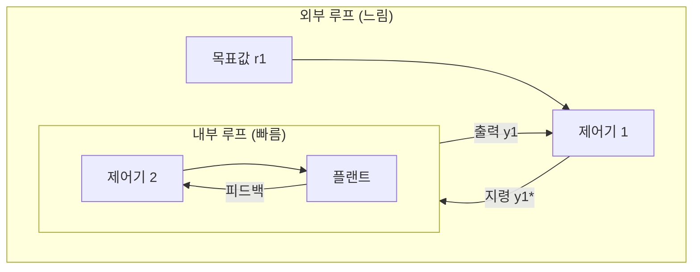
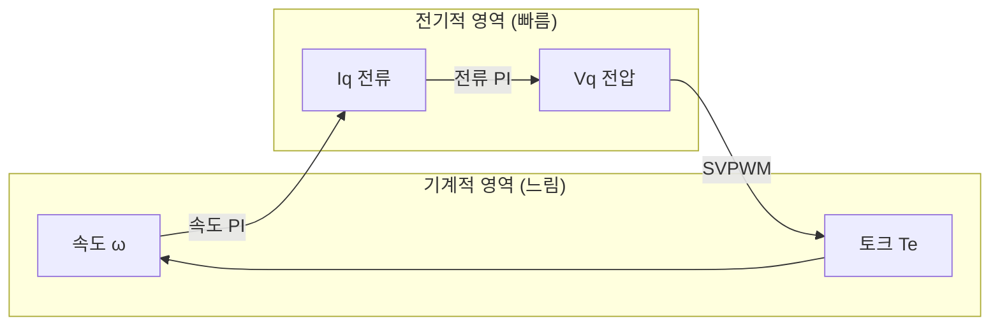
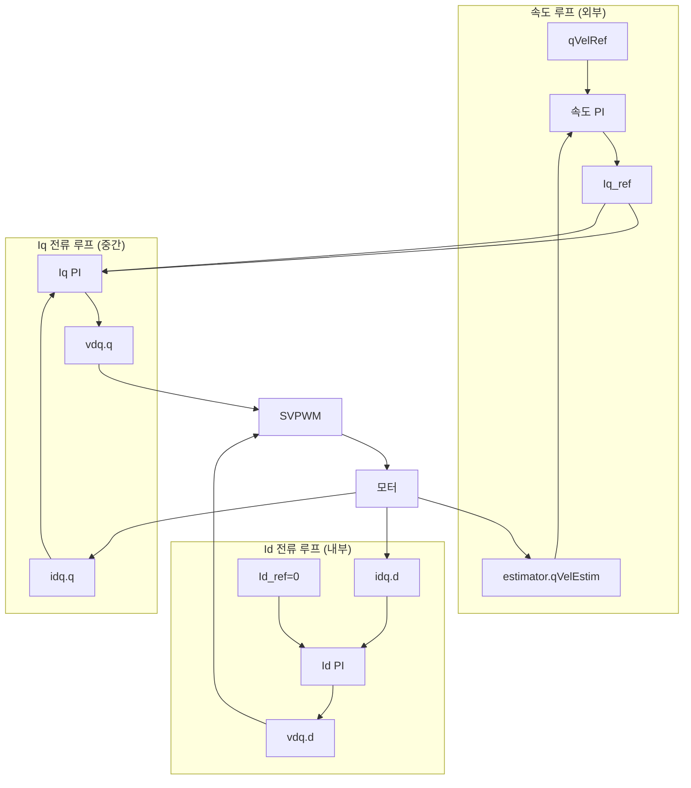
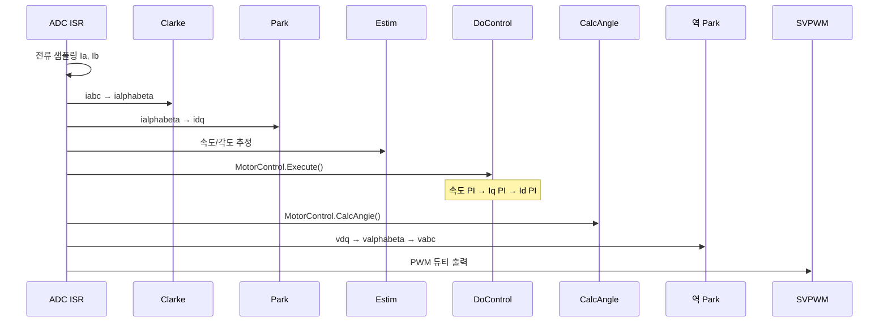

# Chapter 10: 캐스케이드 제어 구조 (Cascade Control Structure)

## 목차

1. [캐스케이드 제어 개요](#1-캐스케이드-제어-개요)
2. [본 프로젝트의 캐스케이드 구조 상세](#2-본-프로젝트의-캐스케이드-구조-상세)
3. [캐스케이드 제어의 장점](#3-캐스케이드-제어의-장점)
4. [캐스케이드 설계 원칙](#4-캐스케이드-설계-원칙)
5. [본 프로젝트 구현 상세](#5-본-프로젝트-구현-상세)
6. [실제 값의 흐름 예제](#6-실제-값의-흐름-예제-본-프로젝트-기준)
7. [캐스케이드 루프 간 상호작용](#7-캐스케이드-루프-간-상호작용)
8. [캐스케이드 튜닝 실전](#8-캐스케이드-튜닝-실전)
9. [외란 제거 성능](#9-외란-제거-성능)
10. [성능 비교](#10-성능-비교)
11. [고급 주제](#11-고급-주제)
12. [디버깅 및 문제 해결](#12-디버깅-및-문제-해결)
13. [요약](#13-요약)

---

## 1. 캐스케이드 제어 개요

### 1.1 캐스케이드 제어란?

**캐스케이드 제어(Cascade Control)**는 여러 개의 제어 루프를 **계층적으로 중첩**하여 구성하는 제어 구조입니다. 외부 루프의 출력이 내부 루프의 지령(Reference)으로 사용되며, 내부 루프가 먼저 빠르게 응답하고 외부 루프가 느리게 전체 시스템을 조정합니다.

```
┌─────────────────────────────────────────────────────────────────┐
│  캐스케이드 제어의 핵심 원리                                        │
│                                                                   │
│  "내부 루프가 외부 루프의 '부하'를 안정화시킨다"                      │
│  → 외부 루프는 안정화된 내부 루프를 제어하는 것처럼 동작              │
│  → 각 루프를 독립적으로 설계·튜닝 가능                               │
└─────────────────────────────────────────────────────────────────┘
```

#### Mermaid 다이어그램: 캐스케이드 개념



### 1.2 단일 루프 vs 캐스케이드 루프 비교

#### 단일 루프 (Single Loop)

```
                    ┌─────────────┐
  속도 지령 ────────►│   단일 PI   │────────► 모터 (속도+전류 동시 제어)
  속도 피드백 ◄─────│   제어기    │
                    └─────────────┘

문제점:
  - 속도와 전류를 동시에 제어 → 설계 복잡
  - 빠른 외란(역기전력)과 느린 외란(부하)을 한 제어기가 처리 → 타협 필요
  - 전류 제한, 과보호 구현 어려움
```

#### 캐스케이드 루프 (Cascade Loop)

```
  속도 지령 ──►┌─────────────┐
               │  속도 PI    │── Iq_ref ──►┌─────────────┐
  속도 피드백 ◄└─────────────┘              │  전류 PI    │── Vq ──► 모터
                                            │  (Iq, Id)   │
  전류 피드백 ◄─────────────────────────────└─────────────┘

장점:
  - 전류 루프: 빠른 역기전력 외란 즉시 제거
  - 속도 루프: 부하 변동만 처리 (전류 루프가 이미 안정화됨)
  - 전류 제한: 내부 루프에서 자연스럽게 구현
```

#### ASCII 비교표

```
┌──────────────────────────────────────────────────────────────────────────┐
│                    단일 루프 vs 캐스케이드 루프                             │
├──────────────────┬─────────────────────────┬─────────────────────────────┤
│      항목        │      단일 루프           │      캐스케이드 루프          │
├──────────────────┼─────────────────────────┼─────────────────────────────┤
│ 제어기 수        │ 1개 (복잡한 설계)         │ 2~3개 (단순한 설계)          │
│ 외란 대응        │ 모든 외란을 한꺼번에      │ 내부→외부 순차 대응          │
│ 전류 보호        │ 별도 로직 필요            │ 내부 루프 출력 제한으로 해결  │
│ 튜닝 난이도      │ 높음 (상호작용 복잡)      │ 낮음 (단계적 튜닝)            │
│ 응답 속도        │ 보통                      │ 빠름 (내부 루프 선행)        │
└──────────────────┴─────────────────────────┴─────────────────────────────┘
```

### 1.3 FOC에서 캐스케이드 제어를 사용하는 이유

FOC(Field Oriented Control)는 **dq 좌표계**에서 d축(자속)과 q축(토크) 전류를 독립적으로 제어합니다. 이 구조는 캐스케이드 제어와 자연스럽게 결합됩니다.

```
FOC + 캐스케이드 결합 이유:

1. 물리적 계층 구조
   ┌─────────────────────────────────────────────────────────┐
   │  기계적 동역학 (느림): J·dω/dt = Te - Tl - B·ω          │
   │       ↑ 토크 Te                                         │
   │  전기적 동역학 (빠름): L·dI/dt = V - R·I - BEMF         │
   │       ↑ 전압 V                                          │
   │  PWM 인버터 (매우 빠름)                                  │
   └─────────────────────────────────────────────────────────┘

2. 토크-전류 선형 관계 (PMSM)
   Te = Kt · Iq   (Id=0 가정, 표면 부착형 영구자석)
   → 속도 제어기 출력 = Iq 지령 = 토크 지령

3. dq 분리
   - Id 루프: 자속 제어 (PMSM에서는 보통 0)
   - Iq 루프: 토크 제어
   - 속도 루프: Iq 지령 생성
```

#### Mermaid: FOC 캐스케이드 물리적 의미



### 1.4 본 프로젝트의 3중 캐스케이드 구조

본 프로젝트(AN1292 기반 FOC)는 **3개의 PI 제어기**가 캐스케이드로 연결됩니다:

```
위치/속도 명령 (X2C_VelRef)
         │
         ▼
┌─────────────────────────────────────────────────────────────────┐
│  [1] 속도 루프 (가장 외부)                                        │
│      입력: 속도 지령 (RPM) vs 추정 속도 (estimator.qVelEstim)      │
│      출력: Iq 전류 지령 (ctrlParm.qVqRef)                         │
│      주기: 20kHz (50µs) - ADC ISR                                 │
└─────────────────────────────────────────────────────────────────┘
         │ Iq_ref
         ▼
┌─────────────────────────────────────────────────────────────────┐
│  [2] 전류 루프 - Iq (중간)                                        │
│      입력: Iq 지령 (ctrlParm.qVqRef) vs 측정 Iq (idq.q)           │
│      출력: Vq 전압 지령 (vdq.q)                                   │
│      주기: 20kHz (50µs)                                           │
└─────────────────────────────────────────────────────────────────┘
         │ Vq
         ▼
┌─────────────────────────────────────────────────────────────────┐
│  [3] 전류 루프 - Id (내부)                                        │
│      입력: Id 지령 (0, PMSM) vs 측정 Id (idq.d)                   │
│      출력: Vd 전압 지령 (vdq.d)                                   │
│      주기: 20kHz (50µs)                                           │
└─────────────────────────────────────────────────────────────────┘
         │ Vd, Vq
         ▼
[역 Park → 역 Clarke → SVPWM → PWM]
```

**참고**: Id와 Iq 전류 루프는 **병렬**로 동작하지만, 둘 다 속도 루프보다 **내부**에 위치합니다. 속도 루프 → Iq → Id 순으로 "의존성"이 있습니다 (속도 PI 출력이 Iq 지령, Id는 고정 0).

---

## 2. 본 프로젝트의 캐스케이드 구조 상세

### 2.1 전체 구조

```
위치/속도 명령 (X2C_VelRef)
    ↓
┌─────────────────────────────────┐
│  속도 루프 (가장 외부)            │
│  입력: 속도 지령 (RPM)            │
│  출력: Iq 전류 지령               │
│  주기: 20kHz (50µs)              │
└─────────────────────────────────┘
    ↓ Iq_ref (ctrlParm.qVqRef)
┌─────────────────────────────────┐
│  전류 루프 - Iq (중간)            │
│  입력: Iq 지령                    │
│  출력: Vq 전압 지령               │
│  주기: 20kHz (50µs)              │
└─────────────────────────────────┘
    ↓ Vq
┌─────────────────────────────────┐
│  전류 루프 - Id (내부)            │
│  입력: Id 지령 (보통 0)           │
│  출력: Vd 전압 지령               │
│  주기: 20kHz (50µs)              │
└─────────────────────────────────┘
    ↓ Vd, Vq
[역 Park → 역 Clarke → SVPWM → PWM]
```

#### Mermaid: 3중 캐스케이드 블록 다이어그램



### 2.2 각 루프의 역할과 특성

#### 속도 루프 (외부 루프)

| 항목 | 내용 |
|------|------|
| **제어 대상** | 기계적 속도 (관성, 부하 포함) |
| **시간 상수** | 느림 (수십~수백 ms) |
| **대역폭** | 낮음 (수십~수백 Hz) |
| **주요 외란** | 부하 토크 변동 |
| **출력** | Iq 전류 지령 (토크 지령) |
| **PI 변수** | `piInputOmega`, `piOutputOmega` |
| **출력 저장** | `ctrlParm.qVqRef` |

```
속도 루프 동역학:
  J·dω/dt = Kt·Iq - Tl - B·ω
  (J: 관성, Kt: 토크상수, Tl: 부하토크, B: 점성마찰)
  → 속도는 전류(Iq)보다 10~100배 느리게 변함
```

#### Iq 전류 루프 (중간 루프)

| 항목 | 내용 |
|------|------|
| **제어 대상** | q축 전류 (토크 성분) |
| **시간 상수** | 빠름 (수 ms) |
| **대역폭** | 높음 (수백 Hz ~ kHz) |
| **주요 외란** | 역기전력 (속도 의존) |
| **출력** | Vq 전압 지령 |
| **PI 변수** | `piInputIq`, `piOutputIq` |
| **출력 저장** | `vdq.q` |

```
Iq 루프 동역학:
  Lq·dIq/dt = Vq - R·Iq - ω·Ld·Id - Ke·ω
  (Ke·ω: 역기전력, 속도가 변할 때마다 즉시 영향)
  → 전류는 전압에 비해 빠르게 추종 가능
```

#### Id 전류 루프 (내부 루프)

| 항목 | 내용 |
|------|------|
| **제어 대상** | d축 전류 (자속 성분) |
| **시간 상수** | 빠름 (수 ms) |
| **대역폭** | 높음 (수백 Hz ~ kHz) |
| **주요 외란** | 역기전력 (속도 의존) |
| **출력** | Vd 전압 지령 |
| **PI 변수** | `piInputId`, `piOutputId` |
| **출력 저장** | `vdq.d` |

```
Id 루프 동역학 (PMSM, Id_ref=0):
  Ld·dId/dt = Vd - R·Id + ω·Lq·Iq
  → 표면 부착형 PMSM에서는 Id=0 유지 (자속 약화 없음)
```

#### 루프 특성 비교 ASCII

```
┌────────────────────────────────────────────────────────────────────────────┐
│                    루프별 시간 상수 및 대역폭                                 │
├──────────────┬──────────────┬──────────────┬───────────────────────────────┤
│     루프     │  시간 상수   │   대역폭     │  외란 대응 속도                 │
├──────────────┼──────────────┼──────────────┼───────────────────────────────┤
│ 속도 루프    │ 50~200 ms    │ 50~200 Hz    │ 부하 변동: 수십 ms 내           │
│ Iq 전류 루프 │ 1~5 ms       │ 500~2000 Hz  │ 역기전력: 1 ms 이내             │
│ Id 전류 루프 │ 1~5 ms       │ 500~2000 Hz  │ 역기전력: 1 ms 이내             │
└──────────────┴──────────────┴──────────────┴───────────────────────────────┘
```

### 2.3 샘플링 주파수 - 왜 모든 루프가 20kHz인가?

**Q: 속도 루프는 대역폭이 ~100Hz로 느린데, 왜 20kHz로 실행하는가?**

**A: 다음 이유들 때문입니다:**

1️⃣ **구현의 단순성**
   - 모든 루프를 동일한 ADC ISR 내에서 실행
   - 별도의 타이머나 decimation 로직 불필요
   - 코드 복잡도 감소

2️⃣ **샘플링 이론 (Nyquist)**
   - 대역폭의 최소 2배, 권장 10배 이상 샘플링
   - 속도 루프 대역폭 ~100Hz
   - 최소 샘플링: 200Hz, 권장: 1kHz 이상
   - 20kHz는 충분히 여유있음 (200배)

3️⃣ **전류 루프 요구사항**
   - 전류 루프는 대역폭 ~1kHz
   - 최소 샘플링: 2kHz, 권장: 10kHz 이상
   - 20kHz는 전류 루프에 적합

4️⃣ **Decimation의 단점**
   - 속도 루프만 느리게 실행 시 복잡도 증가
   - 예: 속도 루프를 1kHz로 실행하려면 20번마다 한 번 실행
   - 디버깅 복잡, 코드 가독성 저하

5️⃣ **계산 부하**
   - 속도 PI 계산 비용은 매우 낮음 (수십 사이클)
   - 20kHz 실행해도 CPU 부하 무시할 수준
   - dsPIC33CK @ 100MHz: 20kHz = 5000 사이클 여유

**결론**:
속도 루프의 대역폭은 100Hz이지만, 샘플링은 20kHz로 해도 문제없고 구현이 단순합니다.
대역폭과 샘플링 주파수는 다른 개념입니다!

- **대역폭**: 제어기가 반응하는 주파수 범위 (PI 계수로 결정)
- **샘플링**: 센서 읽기 및 제어 출력 주기

---

## 3. 캐스케이드 제어의 장점

### 3.1 외란 제거 능력

- **내부 루프가 빠른 외란을 먼저 제거**: 역기전력, 전압 리플 등
- **외부 루프는 느린 외란만 처리**: 부하 토크 변동
- **예시**: 모터 가속 시 역기전력 증가 → 전류 루프가 Vq를 즉시 올려 Iq 유지 → 속도 루프는 이 변화를 "느끼지 못함"

```
외란 제거 시퀀스:

[역기전력 외란]
  모터 가속 → BEMF 증가 → Iq 감소 시도
       ↓
  Iq PI 감지 (50µs 내) → Vq 증가 → Iq 복원
       ↓
  속도 루프: "아무 일 없음" (이미 해결됨)

[부하 토크 외란]
  부하 증가 → 감속 시작
       ↓
  속도 루프 감지 → Iq_ref 증가
       ↓
  Iq PI → Vq 증가 → 토크 증가 → 속도 회복
```

### 3.2 제어 성능 향상

- **각 루프를 독립적으로 설계 가능**: 내부 루프가 "이상적인 액추에이터"로 동작
- **내부 루프가 안정화되면 외부 루프 설계 단순화**: 1차 시스템 근사 가능
- **오버슈트 감소, 정착 시간 단축**: 단일 루프 대비 20~50% 개선 가능

### 3.3 물리적 제약 보호

- **전류 루프에서 과전류 제한**: `Q_CURRCNTR_OUTMAX`, `D_CURRCNTR_OUTMAX`로 출력 클리핑
- **속도 루프는 전류 제한값 내에서만 동작**: `SPEEDCNTR_OUTMAX` = `Q15_PI_SPEED_OUTPUT_LIMIT`
- **모터/인버터 보호**: 내부 루프가 먼저 전류를 제한하므로 외부 명령이 과도해도 안전

```
보호 계층:

  사용자 명령 (무제한)
       ↓
  속도 램프 (가감속 제한) - motor_speed.c
       ↓
  속도 PI (출력 제한: SPEEDCNTR_OUTMAX)
       ↓
  Iq PI (출력 제한: Q_CURRCNTR_OUTMAX)
       ↓
  PWM 듀티 제한 (데드타임, 오버모듈레이션 방지)
```

---

## 4. 캐스케이드 설계 원칙

### 4.1 대역폭 분리 원칙

**Rule of Thumb**: 외부 루프 대역폭 = 내부 루프 대역폭 / 3~10

이 비율을 유지하면:
- 내부 루프가 외부 루프에 "거의 이상적인 추종"으로 보임
- 상호 간섭 최소화
- 안정 마진 확보

#### 본 프로젝트 적용

| 루프 | 대역폭 (목표) | 비고 |
|------|---------------|------|
| 전류 루프 (Id, Iq) | ~1-2 kHz | 50µs 샘플링, Kp=0.045 |
| 속도 루프 | ~100-200 Hz | Kp=0.4 |
| **비율** | **약 1:10** | ✓ 설계 원칙 충족 |

### 4.2 튜닝 순서

```
1. Id 전류 루프 튜닝 (가장 내부)
   - Open Loop 또는 TORQUE_MODE에서 Id=0 유지 확인
   ↓
2. Iq 전류 루프 튜닝
   - Open Loop에서 Iq 추종 확인
   ↓
3. 속도 루프 튜닝 (가장 외부)
   - Closed Loop 전환 후 속도 응답 조정
```

**이유**: 내부 루프가 안정화되어야 외부 루프의 "플랜트"가 정의됨. 불안정한 전류 루프 위에 속도 루프를 얹으면 전체 발진.

### 4.3 센서 요구사항

| 루프 | 샘플링 요구 | 본 프로젝트 |
|------|-------------|-------------|
| 내부 루프 (전류) | 빠른 샘플링 (≥ 전류 대역폭의 5~10배) | 20kHz ADC |
| 외부 루프 (속도) | 상대적으로 느려도 됨 | 20kHz (동일 ISR) |

**본 프로젝트**: 모든 루프가 **동일 ADC ISR (20kHz)** 내에서 실행됨. 속도는 BEMF 추정기(`Estim()`)에서 매 50µs마다 갱신.

---

## 5. 본 프로젝트 구현 상세

### 5.1 소스 코드 위치

| 파일 | 함수/내용 | 라인 |
|------|-----------|------|
| `src/motor/motor_control.c` | `DoControl()` - 전류 루프(Id, Iq), 속도 루프 실행 | 133~245 |
| `src/motor/motor_control.c` | `InitControlParameters()` - PI 계수 초기화 | 293~323 |
| `src/pmsm.c` | `_ADCInterrupt()` - ADC ISR, `MotorControl.Execute()` 호출 | 306~376 |
| `src/foc/userparms.h` | PI 계수 정의 (D/Q/Speed) | 215~229 |

### 5.2 실제 코드 흐름 (pmsm.c ADC ISR)

**소스**: `src/pmsm.c` 306~420행

```c
void __attribute__((__interrupt__, no_auto_psv)) _ADCInterrupt()
{
    // ... (Single Shunt 분기, RunMotor 체크)

    if (uGF.bits.RunMotor)
    {
        if (singleShuntParam.adcSamplePoint == 0)
        {
            // 1. 전류 측정
            measureInputs.current.Ia = ADCBUF_INV_A_IPHASE1;
            measureInputs.current.Ib = ADCBUF_INV_A_IPHASE2;

#ifdef SINGLE_SHUNT
            SingleShunt_PhaseCurrentReconstruction(&singleShuntParam);
            MCAPP_MeasureCurrentCalibrate(&measureInputs);
            iabc.a = singleShuntParam.Ia;
            iabc.b = singleShuntParam.Ib;
#else
            MCAPP_MeasureCurrentCalibrate(&measureInputs);
            // ... CW_CCW에 따른 Ia, Ib 스왑
#endif

            // 2. Clarke 변환 (ABC → αβ)
            MC_TransformClarke_Assembly(&iabc, &ialphabeta);

            // 3. Park 변환 (αβ → dq)
            MC_TransformPark_Assembly(&ialphabeta, &sincosTheta, &idq);

            // 4. 속도/각도 추정
            Estim();

            // 5. 캐스케이드 제어 실행 ★
            MotorControl.Execute();   // → DoControl()

            // 6. 각도 계산 (Open/Closed Loop 전환)
            MotorControl.CalcAngle();

            // 7. 각도 소스 선택
            if (uGF.bits.OpenLoop == 1)
                thetaElectrical = thetaElectricalOpenLoop;
            else
                thetaElectrical = estimator.qRho;

            // 8. 역변환 (dq → αβ → ABC)
            MC_CalculateSineCosine_Assembly_Ram(thetaElectrical, &sincosTheta);
            MC_TransformParkInverse_Assembly(&vdq, &sincosTheta, &valphabeta);
            MC_TransformClarkeInverseSwappedInput_Assembly(&valphabeta, &vabc);

            // 9. SVPWM 계산 및 PWM 업데이트
#ifdef SINGLE_SHUNT
            SingleShunt_CalculateSpaceVectorPhaseShifted(&vabc, pwmPeriod, &singleShuntParam);
            PWMDutyCycleSetDualEdge(&singleShuntParam.pwmDutycycle1, &singleShuntParam.pwmDutycycle2);
#else
            MC_CalculateSpaceVectorPhaseShifted_Assembly(&vabc, pwmPeriod, &pwmDutycycle);
            PWMDutyCycleSet(&pwmDutycycle);
#endif
        }
    }
    // ...
}
```

#### Mermaid: ADC ISR 내 캐스케이드 호출 순서



### 5.3 DoControl() 내부 (motor_control.c)

**소스**: `src/motor/motor_control.c` 133~245행

#### Open Loop 모드

```c
if (uGF.bits.OpenLoop)
{
    // ... ChangeMode 처리 (초기화)

    /* PI control for D */
    piInputId.inMeasure = idq.d;
    piInputId.inReference = ctrlParm.qVdRef;   // 보통 0
    MC_ControllerPIUpdate_Assembly(piInputId.inReference,
                                   piInputId.inMeasure,
                                   &piInputId.piState,
                                   &piOutputId.out);
    vdq.d = piOutputId.out;

    // Vd 기반 Vq 최대값 제한 (전압 벡터 크기 제한)
    temp_qref_pow_q15 = (int16_t)(__builtin_mulss(piOutputId.out, piOutputId.out) >> 15);
    temp_qref_pow_q15 = Q15(MAX_VOLTAGE_VECTOR) - temp_qref_pow_q15;
    piInputIq.piState.outMax = _Q15sqrt(temp_qref_pow_q15);
    piInputIq.piState.outMin = -piInputIq.piState.outMax;

    /* PI control for Q - 속도 루프 바이패스, 고정 Iq 지령 */
    ctrlParm.qVelRef = Q_CURRENT_REF_OPENLOOP;   // userparms.h: NORM_CURRENT(2.0)
    ctrlParm.qVqRef = ctrlParm.qVelRef;
    piInputIq.inMeasure = idq.q;
    piInputIq.inReference = ctrlParm.qVqRef;
    MC_ControllerPIUpdate_Assembly(piInputIq.inReference,
                                   piInputIq.inMeasure,
                                   &piInputIq.piState,
                                   &piOutputIq.out);
    vdq.q = piOutputIq.out;
}
```

#### Closed Loop 모드 (캐스케이드)

```c
else  /* Closed Loop Vector Control */
{
    /* 속도 지령: 외부 50us 램프(Timer2)에서 처리된 X2C_VelRef 반영 */
    ctrlParm.targetSpeed = X2C_VelRef;
    ctrlParm.qVelRef = ctrlParm.targetSpeed;

    // ... TUNING 모드 분기, ChangeMode 처리

    #ifndef TORQUE_MODE
        /* [외부 루프] 속도 PI */
        piInputOmega.inMeasure = estimator.qVelEstim + (ctrlParm.qVqRef >> 4);  // Feed-forward 항
        piInputOmega.inReference = ctrlParm.qVelRef;
        MC_ControllerPIUpdate_Assembly(piInputOmega.inReference,
                                       piInputOmega.inMeasure,
                                       &piInputOmega.piState,
                                       &piOutputOmega.out);
        ctrlParm.qVqRef = piOutputOmega.out;   // → Iq 지령
    #else
        ctrlParm.qVqRef = ctrlParm.qVelRef;    // 토크 모드: 속도 PI 바이패스
    #endif

    ctrlParm.qVdRef = 0;   // PMSM: Id_ref = 0

    /* [내부 루프] Id 전류 PI */
    piInputId.inMeasure = idq.d + (vdq.d >> 4);   // 전압 Feed-forward
    piInputId.inReference = ctrlParm.qVdRef;
    MC_ControllerPIUpdate_Assembly(piInputId.inReference,
                                   piInputId.inMeasure,
                                   &piInputId.piState,
                                   &piOutputId.out);
    vdq.d = piOutputId.out;

    // Vd 기반 Vq 최대값 제한
    temp_qref_pow_q15 = (int16_t)(__builtin_mulss(piOutputId.out, piOutputId.out) >> 15);
    temp_qref_pow_q15 = Q15(MAX_VOLTAGE_VECTOR) - temp_qref_pow_q15;
    piInputIq.piState.outMax = _Q15sqrt(temp_qref_pow_q15);
    piInputIq.piState.outMin = -piInputIq.piState.outMax;

    /* [중간 루프] Iq 전류 PI */
    piInputIq.inMeasure = idq.q + (vdq.q >> 4);   // 전압 Feed-forward
    piInputIq.inReference = ctrlParm.qVqRef;      // 속도 PI 출력
    MC_ControllerPIUpdate_Assembly(piInputIq.inReference,
                                   piInputIq.inMeasure,
                                   &piInputIq.piState,
                                   &piOutputIq.out);
    vdq.q = piOutputIq.out;
}
```

#### PI 계수 (userparms.h 215~229행)

```c
/* D Control Loop Coefficients */
#define D_CURRCNTR_PTERM       Q15(0.045)
#define D_CURRCNTR_ITERM       Q15(0.003)
#define D_CURRCNTR_CTERM       Q15(0.999)
#define D_CURRCNTR_OUTMAX      0x7FFF

/* Q Control Loop Coefficients */
#define Q_CURRCNTR_PTERM       Q15(0.045)
#define Q_CURRCNTR_ITERM       Q15(0.003)
#define Q_CURRCNTR_CTERM       Q15(0.999)
#define Q_CURRCNTR_OUTMAX      0x7FFF

/* Velocity Control Loop Coefficients */
#define SPEEDCNTR_PTERM        Q15(0.4)
#define SPEEDCNTR_ITERM        Q15(0.003)
#define SPEEDCNTR_CTERM        Q15(0.999)
#define SPEEDCNTR_OUTMAX       Q15_PI_SPEED_OUTPUT_LIMIT   // NORM_CURRENT(10.0)
```

---

## 6. 실제 값의 흐름 예제 (본 프로젝트 기준)

### 6.1 변수 용어 정리

먼저 사용되는 변수들을 정리합니다:

| 변수 | 타입 | 단위 | 설명 | Q15 범위 |
|------|------|------|------|----------|
| `ctrlParm.qVelRef` | int16_t | 전기각속도 | 속도 지령 (입력) | -32768~32767 |
| `estimator.qVelEstim` | int16_t | 전기각속도 | 추정 속도 (측정) | -32768~32767 |
| `ctrlParm.qVqRef` | int16_t | Q15 전류 | Iq 지령 (속도 PI 출력) | -32768~32767 |
| `idq.d` | int16_t | Q15 전류 | Id 측정값 | -32768~32767 |
| `idq.q` | int16_t | Q15 전류 | Iq 측정값 | -32768~32767 |
| `vdq.d` | int16_t | Q15 전압 | Vd 출력 (Id PI 출력) | -32768~32767 |
| `vdq.q` | int16_t | Q15 전압 | Vq 출력 (Iq PI 출력) | -32768~32767 |

**Q15 형식 변환**:
```c
// 실제 RPM → 전기각속도 Q15
int16_t qVelRef = (RPM * NOPOLESPAIRS * 65536) / 60 / 기준속도;

// Q15 전류 → 실제 전류 (A)
float current_A = (idq.q / 32768.0) * NORM_CURRENT_CONST * 32768;

// Q15 전압 → 실제 전압 (V)
float voltage_V = (vdq.q / 32768.0) * DC_BUS_VOLTAGE;
```

### 6.2 시나리오: 정지 상태에서 1000 RPM으로 가속

**초기 상태** (t=0ms, 정지):
```
속도:
  qVelRef = 0        (지령: 0 RPM)
  qVelEstim = 0      (실제: 0 RPM)

전류:
  qVqRef = 0         (Iq 지령)
  idq.q = 0          (Iq 측정)
  idq.d = 0          (Id 측정)

전압:
  vdq.q = 0
  vdq.d = 0
```

**t=1ms: 속도 지령 인가**
```
1. 사용자 명령: 1000 RPM

2. 속도 램프 (50µs 주기로 천천히 증가) - motor_speed.c, Timer2 ISR
   qVelRef = 0 → 200 → 400 → ... (수십 ms에 걸쳐)

3. t=1ms 시점 (램프 초기):
   qVelRef = 200 (약 100 RPM 상당, Q15)
   qVelEstim = 0 (아직 정지)
```

**t=1ms, 첫 번째 PI 실행**:

```c
// [외부 루프] 속도 PI (motor_control.c:209-215)
piInputOmega.inReference = 200;    // qVelRef
piInputOmega.inMeasure = 0;        // qVelEstim (Feed-forward 제외 시)
// 오차 = 200 - 0 = 200

MC_ControllerPIUpdate_Assembly(...);
// Kp = Q15(0.4) = 13107
// Ki = Q15(0.003) = 98
// 출력 = Kp * 오차 = 13107 * 200 / 32768 ≈ 80
piOutputOmega.out = 80;

// → Iq 지령 생성
ctrlParm.qVqRef = 80;
```

**해석**:
- 속도 오차 200 → Iq 지령 80 생성
- Q15 전류 80 ≈ 0.08A 상당 (소전류 지령)

```c
// [중간 루프] Iq 전류 PI (motor_control.c:238-244)
piInputIq.inReference = 80;      // qVqRef (속도 PI 출력)
piInputIq.inMeasure = 0;         // idq.q (아직 전류 없음)
// 오차 = 80 - 0 = 80

MC_ControllerPIUpdate_Assembly(...);
// Kp = Q15(0.045) = 1474
// Ki = Q15(0.003) = 98
// 출력 = Kp * 오차 = 1474 * 80 / 32768 ≈ 3.6
piOutputIq.out = 3600;  // (실제는 정수 연산)

// → Vq 전압 지령 생성
vdq.q = 3600;
```

**해석**:
- Iq 오차 80 → Vq 전압 3600 생성
- Q15 전압 3600 ≈ 11% 전압 (DC 버스 24V 기준 ~2.6V)

```c
// [내부 루프] Id 전류 PI (motor_control.c:223-229)
piInputId.inReference = 0;       // ctrlParm.qVdRef (항상 0)
piInputId.inMeasure = 0;        // idq.d
// 오차 = 0 - 0 = 0

MC_ControllerPIUpdate_Assembly(...);
piOutputId.out = 0;

// → Vd 전압 지령 생성
vdq.d = 0;
```

**해석**:
- Id는 0으로 유지 (PMSM 표준 제어)

**t=1ms 후반: PWM 업데이트**
```
vdq.d = 0, vdq.q = 3600
  ↓ 역 Park 변환 (θ = 0도 가정)
vα = 3600, vβ = 0
  ↓ 역 Clarke 변환
Va = 0, Vb = -1800, Vc = -1800
  ↓ SVPWM
PWM Duty: ~51%, ~49%, ~49% (대략)
```

**t=2ms: 전류 발생 시작**
```
모터에 전류 흐르기 시작:
  idq.q = 70 (측정값, 지령 80에 근접)
  idq.d = 5  (약간의 오차)

속도:
  qVelEstim = 10 (약간 회전 시작)
  qVelRef = 400 (램프 계속 증가)
```

**t=2ms, PI 실행**:

```c
// [외부] 속도 PI
오차 = 400 - 10 = 390
출력 = 13107 * 390 / 32768 + 적분항 ≈ 156
ctrlParm.qVqRef = 156 (Iq 지령 증가)

// [중간] Iq 전류 PI
오차 = 156 - 70 = 86
출력 = 1474 * 86 / 32768 + 적분항 ≈ 3900
vdq.q = 3900 (Vq 증가)

// [내부] Id 전류 PI
오차 = 0 - 5 = -5
출력 = 1474 * (-5) / 32768 + 적분항 ≈ -200
vdq.d = -200 (Id를 0으로 되돌리려는 전압)
```

**t=50ms: 정상 상태 도달**
```
속도:
  qVelRef = 2000 (1000 RPM 상당)
  qVelEstim = 1998 (거의 추종)
  
전류:
  qVqRef = 500 (부하에 따라)
  idq.q = 498
  idq.d = 1 (거의 0)

전압:
  vdq.q = 15000 (역기전력 + 손실 보상)
  vdq.d = -50 (Id 미세 조정)
```

### 6.3 값의 범위

**정상 운전 시 (1000 RPM, 부하 50%)**:

| 변수 | 일반적 값 | 설명 |
|------|-----------|------|
| `qVelRef` | 2000 | 1000 RPM (극쌍수 1) |
| `qVelEstim` | 1990~2010 | 추정 오차 ±1% |
| `qVqRef` | 300~800 | 부하에 따라 (토크 지령) |
| `idq.q` | 290~810 | 전류 추종 (±10 오차) |
| `idq.d` | -10~10 | 거의 0 유지 |
| `vdq.q` | 10000~20000 | 역기전력 보상 |
| `vdq.d` | -100~100 | Id 제어용 |

**고속 운전 시 (5000 RPM)**:

| 변수 | 값 | 변화 |
|------|-----|------|
| `qVelRef` | 10000 | 5배 증가 |
| `qVqRef` | 500~1000 | 부하 동일 시 증가 (손실 증가) |
| `vdq.q` | 25000~30000 | 역기전력 크게 증가 |

### 6.4 캐스케이드 효과 확인

**부하 급증 시나리오** (t=100ms, 갑자기 부하 50% → 100%):

```
t=100.0ms: 부하 급증
  → 모터 감속 시작
  
t=100.05ms: (1 샘플 후)
  qVelEstim = 1998 → 1950 (감속 감지)
  
  [속도 PI]
  오차 = 2000 - 1950 = 50 (증가)
  → qVqRef = 500 → 600 (Iq 지령 증가, 토크 증가 요구)
  
  [Iq PI]
  오차 = 600 - 500 = 100
  → vdq.q = 15000 → 17000 (전압 증가)
  
  [결과]
  전류 증가 → 토크 증가 → 속도 회복 시작
```

**타임라인**:
```
0.00ms: 부하 급증
0.05ms: 속도 루프 감지 → Iq 지령 증가
0.10ms: 전류 상승 시작
1.00ms: 전류 도달
5.00ms: 속도 회복 50%
20.0ms: 속도 회복 완료
```

**캐스케이드 장점 확인**:
- 전류 루프: ~1ms 응답 (빠름) → 토크 빠르게 증가
- 속도 루프: ~20ms 응답 (느림) → 안정적 속도 제어
- 역기전력 변동은 전류 루프가 자동 보상 (속도 루프는 모름)

---

## 7. 캐스케이드 루프 간 상호작용

### 7.1 속도 → 전류 루프

```
속도 오차 (qVelRef - qVelEstim) → 속도 PI → Iq_ref 증가
  ↓
Iq_ref 증가 → Iq PI → Vq 증가
  ↓
Vq 증가 → 토크 증가 → 가속
  ↓
속도 증가 → 속도 오차 감소
```

#### Mermaid: 속도-전류 연쇄 반응


### 7.2 전류 제한의 영향

```c
// motor_control.c - InitControlParameters() 307~312행
piInputIq.piState.outMax = Q_CURRCNTR_OUTMAX;
piInputIq.piState.outMin = -piInputIq.piState.outMax;
```

전류 제한 시:
- **속도 루프 관점**: "요청한 토크를 낼 수 없음"
- **속도 PI의 적분기가 누적** → Integral Windup
- **해결**: Anti-windup (Kc 항) - `Q_CURRCNTR_CTERM = 0.999`

```
Integral Windup 시나리오:

  속도 지령 20000 RPM, 실제 15000 RPM (부하 과다)
       ↓
  속도 PI: 오차 큼 → Iq_ref 계속 증가 시도
       ↓
  Iq PI: 출력이 Q_CURRCNTR_OUTMAX에서 클리핑
       ↓
  속도 PI 적분기: 제한에 막혀도 오차는 그대로 → 적분기만 폭발
       ↓
  부하 감소 시: 적분기 값이 커서 오버슈트 심함

  Kc (Anti-windup): 출력 포화 시 적분기 증가 억제
```

---

## 8. 캐스케이드 튜닝 실전

### 8.1 전류 루프 튜닝

```
목표: 빠른 전류 추종, 리플 최소화

Step 1: Open Loop에서 Id/Iq 파형 확인
  - idq.d, idq.q가 지령을 잘 추종하는지 X2CScope로 확인

Step 2: Kp 증가 (0.02 → 0.045)
  - 전류 추종 속도 향상
  - 과도하면 리플 발생, 발진

Step 3: Ki 추가 (0.003)
  - 정상상태 오차 제거
  - 역기전력 보상

Step 4: Kc 조정 (0.999)
  - Anti-windup
  - 출력 포화 시 적분기 누적 방지
```

**본 프로젝트 설정** (`userparms.h` 215~224행):
- D/Q: Kp=0.045, Ki=0.003, Kc=0.999

### 8.2 속도 루프 튜닝

```
목표: 빠른 속도 응답, 오버슈트 최소화

전제 조건: 전류 루프가 안정화되어야 함!

Step 1: Closed Loop 전환
  - OPEN_LOOP_FUNCTIONING 비활성화
  - Open Loop 램프 완료 후 자동 전환

Step 2: Kp 증가 (0.1 → 0.4)
  - 속도 응답 향상
  - 과도하면 오버슈트 발생

Step 3: Ki 추가 (0.003)
  - 부하 변동 시 정상상태 오차 제거
  - 과도하면 느린 발진
```

**본 프로젝트 설정** (`userparms.h` 226~229행):
- Speed: Kp=0.4, Ki=0.003, Kc=0.999

### 8.3 대역폭 확인

X2CScope로 계단 응답 측정:

| 루프 | 상승 시간 (목표) | 대역폭 (BW ≈ 0.35/Tr) |
|------|------------------|------------------------|
| 전류 루프 | ~0.5-1 ms | ~350-700 Hz (실제 1-2 kHz 가능) |
| 속도 루프 | ~10-20 ms | ~17-35 Hz (실제 100-200 Hz) |
| **비율** | - | **약 1:10** ✓ |

---

## 9. 외란 제거 성능

### 9.1 역기전력 외란

```
모터 가속 → 역기전력(BEMF) 증가
  ↓
전류 감소 시도 (V = L·dI/dt + R·I + BEMF)
  ↓
전류 루프 감지 (50µs 내) → Vq 증가로 보상
  ↓
전류 유지 (속도 루프는 개입 불필요)
```

**핵심**: 역기전력은 속도에 비례. 속도가 변할 때마다 전류에 즉시 영향. 전류 루프가 빠르게 보상하므로 속도 루프는 "전류가 잘 추종한다"고 가정하고 속도만 제어.

### 9.2 부하 토크 외란

```
부하 증가 → 감속 시작
  ↓
속도 루프 감지 → Iq_ref 증가
  ↓
전류 루프 → Iq 증가 (토크 증가)
  ↓
속도 회복
```

**핵심**: 부하는 기계적 관성 때문에 속도가 먼저 변함. 속도 루프가 이 변화를 감지하고 Iq를 올려 토크를 보상.

#### Mermaid: 외란 유형별 대응 루프


---

## 10. 성능 비교

### 10.1 단일 루프 vs 캐스케이드

| 특성 | 단일 루프 | 캐스케이드 |
|------|-----------|-----------|
| 외란 제거 | 느림 | 빠름 |
| 오버슈트 | 크다 | 작다 |
| 정착 시간 | 길다 | 짧다 |
| 튜닝 난이도 | 높다 | 낮다 (단계적) |
| 전류 보호 | 어렵다 | 쉽다 (내부 루프) |

### 10.2 본 프로젝트 성능

```
전류 루프:
  - 응답 시간: ~1 ms
  - 정상상태 오차: <1%
  - 리플: <5%

속도 루프:
  - 응답 시간: ~20 ms
  - 오버슈트: <10%
  - 정상상태 오차: <1 RPM
```

---

## 11. 고급 주제

### 11.1 Feed-Forward 보상

본 프로젝트에서 이미 사용 중인 Feed-Forward:

```c
// motor_control.c 208행, 222행, 237행
piInputOmega.inMeasure = estimator.qVelEstim + (ctrlParm.qVqRef >> 4);  // 속도 루프
piInputId.inMeasure = idq.d + (vdq.d >> 4);   // Id 루프
piInputIq.inMeasure = idq.q + (vdq.q >> 4);   // Iq 루프
```

**역기전력 Feed-Forward (선택적)**:
```c
// 이론적 (현재 미구현)
vdq.q += Ke * omega;  // 역기전력 예측 보상
```

### 11.2 Cross-Coupling 보상

```
Vd = ... - ω·Lq·Iq   // d-q 간 결합 보상
Vq = ... + ω·Ld·Id
```

본 프로젝트: Estimator와 PI 제어기가 결합 효과를 간접적으로 보상. 명시적 Cross-Coupling은 미구현.

### 11.3 Field Weakening과 캐스케이드

```
고속 영역 (기본 속도 초과):
  속도 루프 → Iq_ref, Id_ref (음수)
    ↓
  Id 루프 → 자속 약화 (Id < 0)
  Iq 루프 → 토크 제어
```

**현재 상태**: `fdweak.c`에 Field Weakening 구현되어 있으나, `DoControl()`에서 `ctrlParm.qVdRef = 0` 고정으로 **미사용**. 상세는 `docs/03_FOC_algorithm.md` 참조.

---

## 12. 디버깅 및 문제 해결

### 12.1 캐스케이드 특유의 문제

| 증상 | 원인 | 해결 |
|------|------|------|
| 속도 루프 발진, 전류 루프 정상 | 속도 Kp 과다 | SPEEDCNTR_PTERM 감소 |
| 전류 루프 발진 | 전류 Kp 과다 또는 샘플링 지연 | Q/D_CURRCNTR_PTERM 감소 |
| 속도 오차 큼, 전류는 제한값 | 전류 제한 또는 부하 과다 | Q_CURRCNTR_OUTMAX, SPEEDCNTR_OUTMAX 확인 |
| 전류 오차 큼 | 모터 파라미터 불일치 (Rs, Ls) | NORM_RS, NORM_LSDTBASE 재측정 |

### 12.2 X2CScope 모니터링 변수

```
전류 루프:
  - idq.d, idq.q (측정값)
  - piInputId.inReference, piInputIq.inReference (지령값)
  - vdq.d, vdq.q (출력)

속도 루프:
  - estimator.qVelEstim (측정값)
  - ctrlParm.qVelRef (지령값)
  - piOutputOmega.out (출력 = Iq_ref)
  - ctrlParm.qVqRef (Iq 지령, 속도 PI 출력)
```

### 12.3 TORQUE_MODE 활용

`userparms.h`에서 `#define TORQUE_MODE` 시:
- 속도 PI 비활성화
- `ctrlParm.qVqRef = ctrlParm.qVelRef` (속도 지령을 직접 Iq 지령으로 사용)
- **전류 루프만** 독립 튜닝 가능

---

## 13. 요약

### 본 프로젝트의 캐스케이드 구조

| 항목 | 내용 |
|------|------|
| **구조** | 3중 루프: 속도 → Iq → Id |
| **실행 주기** | 모두 20kHz (동일 ADC ISR) |
| **대역폭 비율** | 전류:속도 ≈ 1:10 |
| **튜닝 순서** | Id → Iq → 속도 (내부 → 외부) |
| **성능** | 빠른 응답, 낮은 오버슈트, 외란 제거 우수 |

### 핵심 코드 경로

| 기능 | 파일:함수 | 라인 |
|------|-----------|------|
| 캐스케이드 실행 | `motor_control.c:DoControl()` | 133~245 |
| ADC ISR 호출 | `pmsm.c:_ADCInterrupt()` | 306~376 |
| PI 계수 | `userparms.h` | 215~229 |

### 관련 문서

- [03_FOC_algorithm.md](03_FOC_algorithm.md) - FOC 전체 흐름
- [09_PID_tuning_guide.md](09_PID_tuning_guide.md) - PI 튜닝 상세
