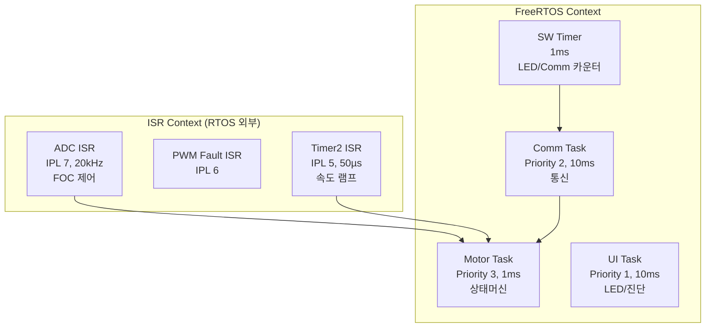

# dsPIC33CK FOC 모터제어 시스템 문서

## 프로젝트 개요

본 프로젝트는 **Microchip AN1292 Application Note**를 기반으로 한 dsPIC33CK256MP508 마이크로컨트롤러 기반의 3상 BLDC/PMSM 모터 제어 시스템입니다. FOC (Field Oriented Control) 알고리즘을 사용하여 고성능 모터 제어를 구현하며, FreeRTOS 실시간 운영체제를 통합하여 안정적인 멀티태스킹 환경을 제공합니다.

### 주요 특징

- **FOC 벡터 제어**: Clarke/Park 변환 기반 고성능 모터 제어 (20kHz)
- **BEMF 기반 센서리스 제어**: 속도/각도 추정기를 통한 홀 센서 불필요
- **FreeRTOS 통합**: 멀티태스킹 기반 모듈화된 시스템 구조
- **UART 통신**: ASCII-hex 프로토콜 기반 원격 제어
- **5-상태 머신**: 체계적인 모터 시작/정지 시퀀스
- **안전 기능**: 과전류 검출, 통신 타임아웃, Stall 검사
- **가변 속도 제어**: 비대칭 램프 기반 부드러운 가감속

### 하드웨어 사양

| 항목 | 사양 |
|------|------|
| **마이크로컨트롤러** | dsPIC33CK256MP508 |
| **클럭** | 200MHz (FCY=100MHz) |
| **PWM 주파수** | 20kHz (Center-Aligned) |
| **제어 주기** | 50µs (ADC ISR) |
| **전류 측정** | Dual Shunt (Single Shunt 지원) |
| **통신** | UART2 (19200 baud, 8N1) |
| **개발 보드** | LVMC (Low Voltage Motor Control) |

### 소프트웨어 구조

```
┌──────────────────────────────────────────────────────────────┐
│                    Application Layer                          │
│  ┌─────────────────┐  ┌──────────────┐  ┌─────────────────┐ │
│  │ Motor State     │  │ Communication│  │ UI (LED/Morse)  │ │
│  │ Machine         │  │ Module       │  │                 │ │
│  └─────────────────┘  └──────────────┘  └─────────────────┘ │
├──────────────────────────────────────────────────────────────┤
│                    FreeRTOS Layer                             │
│  ┌─────────────────┐  ┌──────────────┐  ┌─────────────────┐ │
│  │ Motor Task      │  │ Comm Task    │  │ UI Task         │ │
│  │ (Priority 3)    │  │ (Priority 2) │  │ (Priority 1)    │ │
│  └─────────────────┘  └──────────────┘  └─────────────────┘ │
├──────────────────────────────────────────────────────────────┤
│                    FOC Control Layer                          │
│  ┌─────────────────┐  ┌──────────────┐  ┌─────────────────┐ │
│  │ Motor Control   │  │ Motor Speed  │  │ Estimator       │ │
│  │ (PI Controllers)│  │ (Ramp)       │  │ (BEMF)          │ │
│  └─────────────────┘  └──────────────┘  └─────────────────┘ │
├──────────────────────────────────────────────────────────────┤
│                    HAL Layer                                  │
│  ┌─────┐  ┌─────┐  ┌──────┐  ┌────────┐  ┌──────┐  ┌─────┐ │
│  │ PWM │  │ ADC │  │ UART │  │ Timer  │  │ GPIO │  │ CMP │ │
│  └─────┘  └─────┘  └──────┘  └────────┘  └──────┘  └─────┘ │
└──────────────────────────────────────────────────────────────┘
```

### 실시간 실행 구조



## 문서 구조

본 문서는 총 10개의 챕터로 구성되어 있으며, 각 챕터는 독립적으로 읽을 수 있도록 작성되었습니다.

### 📚 Chapter 1: [AN1292 기반 시스템 이해](01_AN1292_base_system.md)

Microchip AN1292 Application Note의 구조와 제공되는 드라이버/라이브러리에 대한 이해를 제공합니다.

- AN1292 소개 및 FOC 기본 개념
- dsPIC33CK256MP508 하드웨어 특성
- 제공된 예제의 기본 구조
- 라이브러리 구성 (motor_control, FreeRTOS)

**대상 독자**: AN1292를 처음 접하는 개발자

---

### 🔧 Chapter 2: [HAL 계층 상세](02_HAL_layer.md)

Hardware Abstraction Layer의 상세 구현과 각 드라이버의 사용법을 설명합니다.

- HAL 아키텍처 및 초기화 순서
- PWM, ADC, UART, Timer, CMP 드라이버
- 각 드라이버의 API 및 사용 예제
- 인터럽트 우선순위 설정

**대상 독자**: 하드웨어 드라이버 수정이 필요한 개발자

---

### ⚙️ Chapter 3: [FOC 제어 알고리즘](03_FOC_algorithm.md)

Field Oriented Control 알고리즘의 상세 구현을 다룹니다.

- FOC 전체 제어 흐름 (20kHz)
- Clarke/Park 변환 (어셈블리 최적화)
- 3중 PI 제어기 (Id, Iq, Speed)
- BEMF 기반 속도/각도 추정
- Open Loop → Closed Loop 전환
- Single Shunt vs Dual Shunt
- 제어 파라미터 튜닝 가이드

**대상 독자**: FOC 알고리즘을 이해하고 튜닝하려는 개발자

---

### 🕐 Chapter 4: [FreeRTOS 실시간 시스템](04_FreeRTOS_structure.md)

FreeRTOS 기반의 실시간 태스크 구조와 동기화 메커니즘을 설명합니다.

- 3개 태스크 구조 (Motor/Comm/UI)
- 태스크 우선순위와 스케줄링 전략
- Software Timer 활용
- ISR과 태스크 간 데이터 공유
- Critical Section 처리

**대상 독자**: 실시간 시스템 설계 및 RTOS 통합 개발자

---

### 🎯 Chapter 5: [사용자 알고리즘 추가](05_user_algorithm.md) ⭐ **핵심 챕터**

AN1292 기본 예제에 추가된 사용자 알고리즘의 상세 구현을 다룹니다.

- **통신 모듈**: 수평 분리 아키텍처 (drv/core/protocol)
- **모터 상태머신**: 5-State Machine (함수포인터 패턴)
- **속도 램프 제어**: 비대칭 가감속 (50µs 주기)
- **통신 건강 체크**: RX Timeout 1초 감시
- **Stall 검사**: 과전류 감지 및 재기동
- **LED 상태 표시**: Blinker + Morse Code

**대상 독자**: 사용자 기능을 추가하려는 모든 개발자 (필독)

---

### 🔥 Chapter 6: [구현 중 발생한 문제와 해결](06_problems_solutions.md)

실제 구현 과정에서 발생한 7가지 주요 문제와 해결 방법을 상세히 기록합니다.

1. FreeRTOS와 고우선순위 ISR 간 API 호출 불가
2. Timer1 1ms 콜백과 RTOS Tick 충돌
3. 통신 단절 시 모터 무한 구동
4. Stall(과전류) 미감지로 인한 손상 위험
5. MotorControl.Reset() 호출 시 경쟁 조건
6. ISR-Task 간 공유 변수 동기화
7. Open Loop → Closed Loop 전환 실패

**대상 독자**: 유사한 문제를 겪고 있거나 예방하려는 개발자

---

### 🚀 Chapter 7: [처음 적용 시 시작 가이드](07_getting_started.md)

처음부터 시스템을 구축하는 단계별 가이드를 제공합니다.

- Step 1: 하드웨어 준비
- Step 2: 개발 환경 구축
- Step 3: 프로젝트 빌드 및 다운로드
- Step 4: 모터 파라미터 설정
- Step 5: 통신 프로토콜 확인
- Step 6: 기본 동작 검증
- Step 7: 사용자 기능 추가

**대상 독자**: 처음 시작하는 개발자 (시작점)

---

### 📖 Chapter 8: [API 레퍼런스](08_API_reference.md)

모든 주요 API 함수의 레퍼런스를 제공합니다.

- HAL API (PWM, ADC, UART, Timer 등)
- Motor Control API
- Communication API
- State Machine API
- Speed API
- LED API

**대상 독자**: 빠른 API 참조가 필요한 개발자

---

### 🎚️ Chapter 9: [PID 튜닝 가이드](09_PID_tuning_guide.md)

FOC PI 제어기 튜닝을 위한 상세 가이드를 제공합니다.

- PID 제어 기초 이론 (P, I, D 물리적 의미)
- FOC 3중 PI 구조 (Id, Iq, Speed)
- 목표별 튜닝 전략 (빠른 응답, 안정적 제어, 고효율, 정밀 제어)
- Ziegler-Nichols, Cohen-Coon, Relay Feedback, 수동 튜닝
- Microchip Excel 계산기 활용
- 본 프로젝트 실전 튜닝 절차
- X2CScope 실시간 튜닝
- 문제 해결 (증상별)

**대상 독자**: PI 계수 튜닝이 필요한 FOC 개발자

---

### 🔄 Chapter 10: [캐스케이드 제어 구조](10_cascade_control_structure.md)

FOC 3중 캐스케이드 제어(속도 → Iq → Id)의 구조와 설계 원칙을 상세히 설명합니다.

- 캐스케이드 제어 개요 (단일 루프 vs 캐스케이드)
- 본 프로젝트 3중 캐스케이드 구조 상세
- **왜 모든 루프가 20kHz인가?** - 샘플링 주파수와 대역폭의 차이
- 각 루프의 역할, 대역폭, 외란 제거
- DoControl() 구현 및 ADC ISR 흐름
- **실제 값의 흐름 예제** - qVelRef, idq, vdq 등 변수별 시나리오 (가속, 부하 급증)
- 캐스케이드 튜닝 실전 및 디버깅
- Feed-Forward, Cross-Coupling, Field Weakening

**대상 독자**: FOC 제어 구조를 깊이 이해하고 최적화하려는 개발자

---

## 개발 환경

### 필수 도구

| 도구 | 버전 | 용도 |
|------|------|------|
| MPLAB X IDE | v6.0 이상 | 통합 개발 환경 |
| XC16 Compiler | v2.0 이상 | C 컴파일러 |
| MPLAB ICD 4 / PICkit 4 | - | 디버거/프로그래머 |

### 선택 도구

- **X2CScope**: 실시간 변수 모니터링 (디버깅용)
- **MATLAB**: 모터 파라미터 계산 (동봉된 xls 파일 사용 가능)

## 빠른 시작

처음 시작하시는 분은 다음 순서로 문서를 읽으시기 바랍니다:

1. **[Chapter 7: 시작 가이드](07_getting_started.md)** - 하드웨어 준비 및 기본 설정
2. **[Chapter 1: AN1292 기반 시스템](01_AN1292_base_system.md)** - 시스템 구조 이해
3. **[Chapter 5: 사용자 알고리즘](05_user_algorithm.md)** - 사용자 기능 구현
4. **[Chapter 6: 문제 해결](06_problems_solutions.md)** - 문제 예방 및 해결

이미 AN1292에 익숙하신 분은 **Chapter 5**부터 읽으시면 됩니다.

## 주요 용어

| 용어 | 설명 |
|------|------|
| **FOC** | Field Oriented Control - 벡터 제어 방식 |
| **Clarke 변환** | 3상(ABC) → 2상 고정좌표계(αβ) |
| **Park 변환** | 2상 고정좌표계(αβ) → 2상 회전좌표계(dq) |
| **BEMF** | Back EMF (역기전력) - 속도 추정에 사용 |
| **SVPWM** | Space Vector PWM - 효율적인 PWM 방식 |
| **Id, Iq** | d축(자속), q축(토크) 전류 |
| **RTOS** | Real-Time Operating System (FreeRTOS) |
| **HAL** | Hardware Abstraction Layer |
| **ISR** | Interrupt Service Routine |
| **DI** | Dependency Injection (의존성 주입) |

## 프로젝트 파일 구조

```
AN1292_dsPIC33CK256MP508_ElecLow/
├── docs/                          # 문서 (본 폴더)
│   ├── README.md                  # 메인 문서 (현재 파일)
│   ├── 01_AN1292_base_system.md
│   ├── 02_HAL_layer.md
│   ├── 03_FOC_algorithm.md
│   ├── 04_FreeRTOS_structure.md
│   ├── 05_user_algorithm.md       # ⭐ 핵심
│   ├── 06_problems_solutions.md
│   ├── 07_getting_started.md
│   ├── 08_API_reference.md
│   ├── 09_PID_tuning_guide.md     # PID 튜닝 가이드
│   ├── 10_cascade_control_structure.md  # 캐스케이드 제어 구조
│   ├── abbreviations.md           # 약어 사전
│   └── communication_flow.md      # 통신 흐름도
├── src/                           # 소스 코드
│   ├── hal/                       # HAL 드라이버
│   ├── foc/                       # FOC 알고리즘
│   ├── motor/                     # 모터 제어 (사용자 추가)
│   ├── comm/                      # 통신 모듈 (사용자 추가)
│   ├── ui/                        # LED/UI (사용자 추가)
│   ├── util/                      # 유틸리티
│   ├── diag/                      # 진단
│   ├── config/                    # FreeRTOS 설정
│   └── pmsm.c                     # 메인 진입점
├── lib/                           # 라이브러리
│   ├── motor_control/             # Microchip FOC 라이브러리
│   ├── freertos/                  # FreeRTOS v10.4.6
│   └── x2c_scope/                 # X2CScope (옵션)
├── pmsm.X/                        # MPLAB X 프로젝트
└── circuit/                       # 회로도 (참조)
```

## 기여 및 라이선스

### AN1292 라이선스

본 프로젝트는 Microchip AN1292 Application Note를 기반으로 하며, Microchip의 소프트웨어 라이선스를 따릅니다. 상업적 사용 시 Microchip 라이선스 조건을 확인하시기 바랍니다.

### 사용자 알고리즘 (src/comm, src/motor, src/ui)

사용자가 추가한 알고리즘 부분은 프로젝트 요구사항에 따라 자유롭게 수정 가능합니다.

## 문의 및 지원

문서 내용 중 불명확하거나 추가가 필요한 부분이 있으면 이슈로 등록해주시기 바랍니다.

---

**작성일**: 2026-03-03  
**대상 MCU**: dsPIC33CK256MP508  
**기반 AN**: Microchip AN1292  
**RTOS**: FreeRTOS v10.4.6
