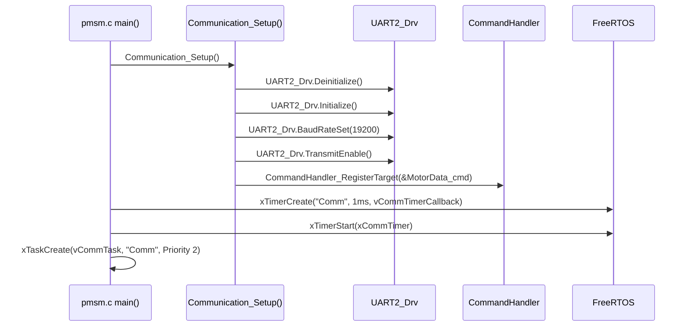
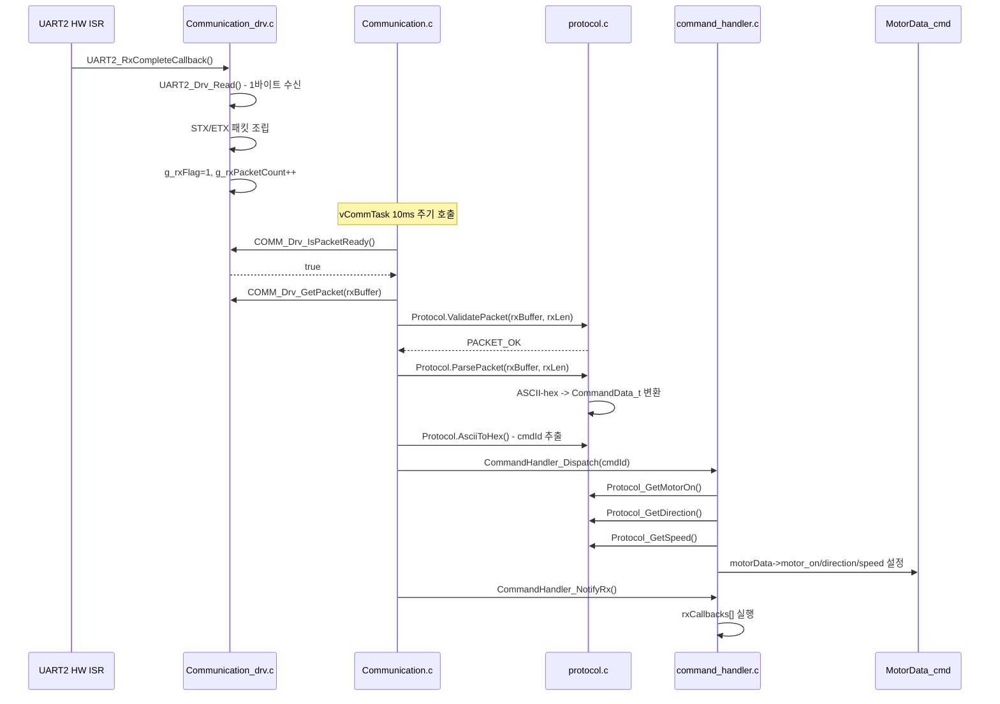
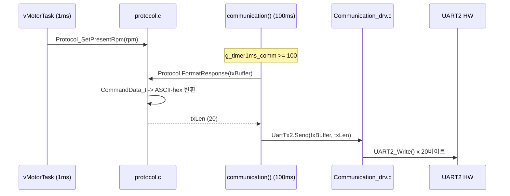
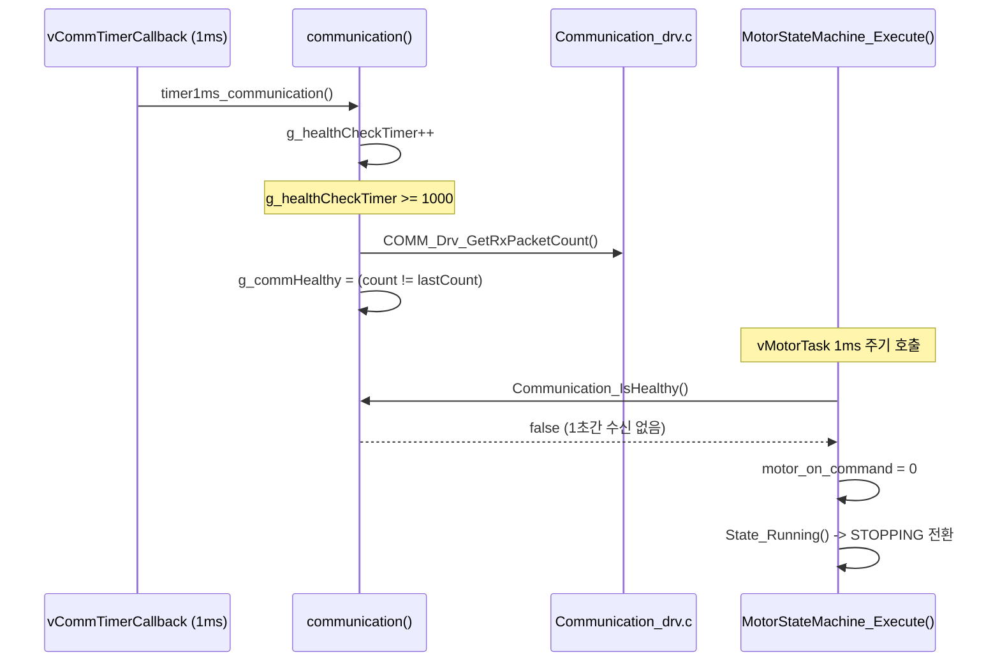

# 통신 모듈 함수 호출 흐름도

> 통신(UART2) 수신 → 파싱 → 모터 명령 반영 → 응답 전송까지의 함수 호출 순서를 정리한 문서입니다.
> 모든 내용은 실제 소스 코드에 기반합니다.

---

## 1. 초기화 흐름

`main()` (pmsm.c) 시작 시 **1회** 실행되는 통신 초기화 함수 호출 순서입니다.



| 순서 | 호출 함수 | 파일 | 역할 |
|:----:|-----------|------|------|
| 1 | `Communication_Setup()` | pmsm.c:114 | 통신 초기화 진입 |
| 2 | `UART2_Drv.Deinitialize()` | uart2.c | UART2 HW 리셋 |
| 3 | `UART2_Drv.Initialize()` | uart2.c | UART2 HW 초기화 |
| 4 | `UART2_Drv.BaudRateSet(19200)` | uart2.c | 보레이트 설정 |
| 5 | `UART2_Drv.TransmitEnable()` | uart2.c | TX 활성화 |
| 6 | `CommandHandler_RegisterTarget(&MotorData_cmd)` | command_handler.c:78 | 모터 데이터 포인터 등록 (DI) |
| 7 | `xTimerCreate("Comm", 1ms)` | pmsm.c:286 | 1ms SW Timer 생성 |
| 8 | `xTimerStart(xCommTimer)` | pmsm.c:289 | 타이머 시작 → `timer1ms_communication()` 반복 |
| 9 | `xTaskCreate(vCommTask)` | pmsm.c:294 | Comm Task 생성 (Priority 2, 10ms 주기) |

---

## 2. RX 수신 흐름 (패킷 수신 → 모터 명령 반영)

UART2 HW ISR에서 시작하여 `MotorData_cmd`까지 도달하는 **전체 수신 경로**입니다.



### RX 호출 트리 (텍스트)

```
[ISR 컨텍스트 - UART2 수신 인터럽트]
│
└─ UART2_RxCompleteCallback()                    ← Communication_drv.c:90
    ├─ UART2_Drv_Read()                          ← uart2.c (HW 1바이트 읽기)
    ├─ rxAssemblyBuf[rxIndex++] = rxByte         (STX/ETX 패킷 조립)
    └─ 패킷 완성 시:
        ├─ memcpy(g_rxPacketBuf, ...)            (완성된 패킷 → 내부 버퍼 복사)
        ├─ g_rxFlag = 1                          (수신 완료 플래그)
        └─ g_rxPacketCount++                     (건강상태 판단용 카운터)

[Task 컨텍스트 - vCommTask 10ms 주기]
│
└─ communication()                               ← Communication.c:65
    │
    ├─ COMM_Drv_IsPacketReady()                  ← Communication_drv.c:135
    │   └─ return (g_rxFlag != 0)
    │
    ├─ COMM_Drv_GetPacket(rxBuffer, 18)          ← Communication_drv.c:146
    │   ├─ memcpy(buf, g_rxPacketBuf, len)       (패킷 데이터 복사)
    │   └─ g_rxFlag = 0                          (플래그 클리어)
    │
    ├─ Protocol.ValidatePacket(rxBuffer, rxLen)   ← protocol.c:94
    │   ├─ 길이 검증 (< COMM_PACKET_MIN_LEN?)
    │   ├─ STX 검증 (data[0] == 0x40?)
    │   └─ ETX 검증 (data[len-3] == 0x2A?)
    │
    ├─ Protocol.ParsePacket(rxBuffer, rxLen)      ← protocol.c:136
    │   ├─ key   = ASCII-hex → uint16 (raw[3..6])
    │   ├─ speed = ASCII-hex → int32  (raw[7..10])
    │   └─ torque= ASCII-hex → uint16 (raw[11..14])
    │
    ├─ Protocol.AsciiToHex(rxBuffer[1..2])        ← protocol.c:120
    │   └─ cmdId = 0x05 (모터 제어 명령)
    │
    ├─ CommandHandler_Dispatch(cmdId)              ← command_handler.c:88
    │   └─ commandTable[0x05] → Command_MotorControl(g_pMotorTarget)
    │       ├─ Protocol_GetMotorOn()   → motorData->motor_on
    │       ├─ Protocol_GetDirection() → motorData->direction
    │       ├─ Protocol_GetSpeed()     → motorData->speed
    │       └─ speed==0 이면 motorData->motor_on = 0
    │
    └─ CommandHandler_NotifyRx()                  ← command_handler.c:127
        └─ rxCallbacks[i]() 순회 실행
```

---

## 3. TX 응답 흐름 (모터 상태 → 응답 전송)

100ms 주기 응답 전송 경로입니다. 모터 태스크가 현재 RPM을 업데이트하고, 통신 태스크가 주기적으로 패킷을 포맷하여 전송합니다.



### TX 호출 트리 (텍스트)

```
[Task 컨텍스트 - vMotorTask 1ms 주기]
│
└─ Protocol_SetPresentRpm(rpm)                   ← protocol.c:246
    └─ stCommandData.present_bldc_rpm = rpm      (현재 RPM 업데이트)

[Task 컨텍스트 - vCommTask 10ms 주기]
│
└─ communication()                               ← Communication.c:65
    │
    └─ (g_timer1ms_comm >= 100 일 때)            100ms 주기 전송
        │
        ├─ Protocol.FormatResponse(txBuffer)     ← protocol.c:167
        │   ├─ outBuf[0] = STX (0x40)
        │   ├─ outBuf[1..2] = "40" (응답 명령 ID)
        │   ├─ outBuf[3..6]  = status_data   → ASCII-hex
        │   ├─ outBuf[7..10] = present_rpm   → ASCII-hex
        │   ├─ outBuf[11..14]= bldc_torque   → ASCII-hex
        │   ├─ outBuf[15..19]= [버전]
        │   └─ return 20 (COMM_TX_PACKET_LEN)
        │
        └─ UartTx2.Send(txBuffer, 20)           ← Communication_drv.c:64
            └─ UART2_Write(data[i]) x 20회      ← uart2.c (HW 바이트 전송)
```

---

## 4. 건강 상태 판단 + RX 타임아웃 모터 정지

1ms SW Timer가 카운터를 증가시키고, 1초 주기로 RX 수신 여부를 판단합니다.
모터 상태머신에서 건강 상태를 확인하여 1초 이상 수신이 없으면 모터를 정지시킵니다.



### 건강 판단 호출 트리 (텍스트)

```
[ISR 컨텍스트 - FreeRTOS SW Timer 1ms 주기]
│
└─ vCommTimerCallback()                          ← pmsm.c:172
    └─ timer1ms_communication()                  ← Communication.c:111
        ├─ g_timer1ms_comm++                     (TX 주기 카운터)
        └─ g_healthCheckTimer++                  (건강 판단 주기 카운터)

[Task 컨텍스트 - vCommTask 10ms 주기]
│
└─ communication()                               ← Communication.c:65
    │
    └─ (g_healthCheckTimer >= 1000 일 때)        1초 주기 판단
        ├─ COMM_Drv_GetRxPacketCount()           ← Communication_drv.c:161
        │   └─ return g_rxPacketCount
        ├─ g_commHealthy = (count != lastCount)  (변화 있으면 true)
        └─ g_lastRxCount = count                 (기준값 갱신)

[Task 컨텍스트 - vMotorTask 1ms 주기]
│
└─ MotorStateMachine_Execute()                   ← motor_statemachine.c:82
    │
    ├─ (stall 검사 → motor_on_command 결정)
    │
    ├─ Communication_IsHealthy()                 ← Communication.c:124
    │   └─ return g_commHealthy
    │
    └─ (g_commHealthy == false 일 때)
        └─ motor_on_command = 0                  → State_Running() → STOPPING 전환
```

---

## 5. 파일별 소속 함수 정리

### Communication_drv.c (드라이버 계층 - HW 바인딩)

| 함수 | 호출자 | 역할 |
|------|--------|------|
| `UART2_RxCompleteCallback()` | UART2 HW ISR | 수신 바이트 → 패킷 조립 |
| `COMM_Drv_IsPacketReady()` | Communication.c | 패킷 수신 완료 여부 |
| `COMM_Drv_GetPacket()` | Communication.c | 패킷 복사 + 플래그 클리어 |
| `COMM_Drv_GetRxPacketCount()` | Communication.c | 수신 카운터 (건강상태용) |
| `UartTx2.Send()` (UARTSend_2) | Communication.c | UART2 바이트 전송 |

### Communication.c (오케스트레이션 계층 - 조정자)

| 함수 | 호출자 | 역할 |
|------|--------|------|
| `communication()` | vCommTask (pmsm.c) | 수신→검증→파싱→디스패치→응답 총괄 |
| `timer1ms_communication()` | vCommTimerCallback (pmsm.c) | 1ms 카운터 증가 |
| `Communication_IsHealthy()` | MotorStateMachine, LedBlinker | 건강 상태 반환 |

### protocol.c (프로토콜 계층 - 파싱/포맷팅)

| 함수 | 호출자 | 역할 |
|------|--------|------|
| `Protocol.ValidatePacket()` | Communication.c | STX/ETX/길이 검증 |
| `Protocol.ParsePacket()` | Communication.c | ASCII-hex → CommandData_t |
| `Protocol.FormatResponse()` | Communication.c | CommandData_t → ASCII-hex TX |
| `Protocol.AsciiToHex()` | Communication.c | cmdId 추출용 |
| `Protocol_GetMotorOn()` | command_handler.c | motor_on 비트 반환 |
| `Protocol_GetDirection()` | command_handler.c | direction 비트 반환 |
| `Protocol_GetSpeed()` | command_handler.c | speed 값 반환 |
| `Protocol_SetPresentRpm()` | vMotorTask (pmsm.c) | 현재 RPM 설정 (TX용) |
| `Protocol_SetStatusData()` | (외부) | 상태 데이터 설정 (TX용) |
| `Protocol_SetBldcTorque()` | (외부) | 토크 데이터 설정 (TX용) |

### command_handler.c (명령 계층 - 디스패치)

| 함수 | 호출자 | 역할 |
|------|--------|------|
| `CommandHandler_RegisterTarget()` | Communication_Setup (pmsm.c) | 모터 데이터 포인터 등록 |
| `CommandHandler_Dispatch()` | Communication.c | cmdId → 핸들러 테이블 검색/실행 |
| `CommandHandler_NotifyRx()` | Communication.c | RX 콜백 배열 순회 실행 |
| `CommandHandler_RegisterRxCallback()` | (외부) | RX 이벤트 콜백 등록 |
| `Command_MotorControl()` (static) | Dispatch 내부 | Protocol Getter → MotorData_t 변환 |

---

## 6. 전체 데이터 흐름 요약

```
┌──────────────────────────────────────────────────────────────────────┐
│                         RX 데이터 흐름                               │
│                                                                      │
│  UART2 HW   →   Communication_drv   →   Communication   →  protocol │
│  (바이트)        (패킷 조립)              (오케스트레이션)   (파싱)    │
│                                               │                      │
│                                               ↓                      │
│                                         command_handler              │
│                                          (디스패치)                   │
│                                               │                      │
│                                               ↓                      │
│                                         MotorData_cmd                │
│                                         (모터 명령 구조체)            │
└──────────────────────────────────────────────────────────────────────┘

┌──────────────────────────────────────────────────────────────────────┐
│                         TX 데이터 흐름                               │
│                                                                      │
│  vMotorTask   →   protocol (Setter)   →   Communication   →  drv    │
│  (현재 RPM)       (CommandData_t)         (FormatResponse)   (Send)  │
│                                                                 │    │
│                                                                 ↓    │
│                                                            UART2 HW  │
└──────────────────────────────────────────────────────────────────────┘

┌──────────────────────────────────────────────────────────────────────┐
│                      건강 상태 흐름                                   │
│                                                                      │
│  SW Timer 1ms  →  Communication  →  Communication_IsHealthy()        │
│  (카운터 증가)    (1초 주기 판단)         │              │            │
│                                          ↓              ↓            │
│                                   MotorStateMachine  LedBlinker      │
│                                   (RX 타임아웃 정지)  (LED 상태 표시) │
└──────────────────────────────────────────────────────────────────────┘
```

---

## 근거 소스 코드

| 파일 | 행 번호 | 내용 |
|------|---------|------|
| pmsm.c | 114-176 | 초기화 + FreeRTOS 태스크/타이머 |
| Communication.c | 65-127 | 오케스트레이션 메인 루프 |
| Communication_drv.c | 90-165 | ISR 콜백 + COMM_Drv API |
| protocol.c | 82-257 | 프로토콜 파싱/포맷팅 + Getter/Setter |
| command_handler.c | 45-155 | 디스패치 테이블 + 콜백 |
| motor_statemachine.c | 82-123 | RX 타임아웃 체크 |
